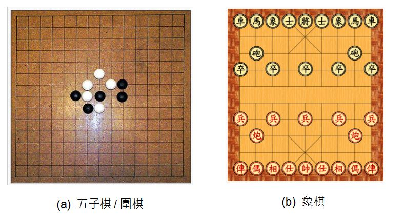
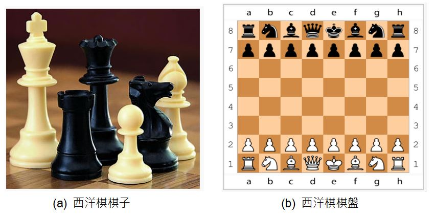

# 電腦下棋

自從有了電腦之後，人們就一直想讓電腦「學會」下棋的能力。事實上、遠在 1952 年，那時的電腦雖然還不具備下棋的能力，但是資訊領域的理論派大師圖靈 (Alan Turing) 就已經在構思如何寫「電腦下棋」的程式了，以下是節錄自維基百科的一段描述：

> 1952年，圖靈寫了一個西洋棋程式。可是，當時沒有一台電腦有足夠的運算能力去執行這個程式，他就模仿電腦，每走一步要用半小時。他與一位同事下了一盤，結果程式輸了。
> 
> 後來美國新墨西哥州洛斯阿拉莫斯國家實驗室的研究群根據圖靈的理論，在ENIAC上設計出世界上第一個電腦程式的象棋－洛斯阿拉莫斯象棋。

世界上有很多種棋類遊戲，對於台灣人而言，最常下的幾種棋類，大至上包含「圍棋、象棋、五子棋、西洋棋」等等。

圍棋的英文名稱為 GO，起源於中國，推測起源時間為大約公元前6世紀。傳說堯的兒子丹朱頑劣，堯發明圍棋以教育丹朱，陶冶其性情。目前圍棋的最早可靠記載見於春秋時期的《左傳》，戰國時期的弈秋是見於史籍的第一位棋手，最早的圍棋文物可以追溯到戰國時期。漢朝時棋盤為17路，南北朝時候，棋盤定型為現在的19道棋盤，傳入朝鮮半島，並且出現了評定棋手水平的圍棋九品制。圍棋逐漸成為中國古代知識階層修身養性的一項必修課目，為「琴棋書畫」四藝之一。

圍棋在公元7世紀傳入日本，很快就流行於宮廷和貴族之中。戰國末期，豐臣秀吉設立棋所。德川幕府時代，出現了在天皇或將軍面前對弈的「御城棋」，日本圍棋逐漸興盛，出現了本因坊、安井、井上、林等圍棋世家。其中坊門尤其人才輩出，先後出現了道策、丈和、秀和、秀策、秀甫、秀榮等傑出棋士。日本圍棋由於廢除了中國古代圍棋的座子制（古代中國圍棋是放四個座子，就是兩黑兩白放在對角星的位置上，雙方在這個基礎上開始布局），布局理論得以極大發展。

明治維新以後，棋手失去幕府支援，開始謀求新的謀生手段，導致了新聞棋戰和現代段位制的出現，並創立了全國性的日本棋院。昭和時代，吳清源和木谷實共同掀起了「新布局」的潮流，開始了現代圍棋的時代。其後日本棋界一流棋手輩出，如坂田榮男，藤澤秀行，高川格，及後來的大竹英雄，武宮正樹，小林光一，石田芳夫等。

五子棋的英文名稱為 GOMOKU，在日本平安時代就有，是日本人頗受歡迎的棋類。自1899年日本棋士黒岩涙香證明了原始規則的五子棋先下必勝後，五子棋邁入一條不斷改良的道路，經過數十年的修改、驗證、再修改，最終發展出加入禁手的五子棋，並經過公開徵名，稱為連珠（RENJU），因此規則在日本成型，又稱為日式規則或連珠規則。

西洋棋的英文就是 chess，又稱歐洲象棋或國際象棋，一般被認爲源自一種印度的遊戲——恰圖蘭卡，7世紀時流傳至波斯成為波斯象棋。穆斯林統治波斯後，它被帶到伊斯蘭的國家。九世紀傳入南歐，10世紀時傳到西班牙，11世紀傳到英國。15世紀末，現代西洋棋的規則逐漸成形。現代的玩法與19世紀時的大致相同。由於流傳已久，因此在各地與各時期產生不少的西洋棋變體規則。

相信大部分的人對以上棋類都相當熟悉，也都知曉這些棋類的遊戲規則了，現在、就讓我們大致介紹一下如何撰寫「電腦下棋」的程式好了。

要寫下棋程式，大致有三個關鍵技巧，第一個是盤面的表達，第二個是評估函數，第三個是搜尋技巧。

* 盤面表達：通常我們可以用一個陣列代表盤面。舉例而言、在支援 Unicode 的系統中，我們可以用字元陣列代表棋盤，對於圍棋或五子棋而言，我們可以用 O 代表白子、 X 代表黑子，然後用空白字元代表該位置還沒有任何子。同樣的、我們可以用中文字的「將士象車馬砲卒」與「帥仕相俥傌炮兵」來代表象棋的子，對於西洋棋也可以如法炮製，只要對每個棋子都取一個中文名字或代號就行了。
* 評估函數：接著我們可以寫一個函數來評估某個盤面的分數，舉例而言、對於五子棋而言，我方連五子得 100 分，對方連五子則扣 100 分，我方連四子得 30 分，對方連四子則扣 30 分， ......，我方連兩子得 2 分，對方連兩子則扣兩分。而對象棋而言，則可以對每一子的重要性計分，例如將算 100 分，車算 50 分，砲算 30 分等等。
* 搜尋策略：對於比較複雜的棋類，我們通常需要事先設想後面好幾步的情況，能夠想得越周全且越遠的人，通常就會越厲害。電腦下棋也是如此，由於現在電腦的速度非常快，因此往往可以利用 Min-Max 演算法搜尋兩三層，甚至到五六層。而且、只要加上 Alpha-Beta Cut 修剪法，有時甚至可以搜尋到十幾層，這樣的能力往往可以超過人類，因此現在電腦在「象棋、西洋棋、五子棋」上的棋力通常很強，即使職業的棋手也未必能夠打贏電腦。(原本筆者在此註記電腦圍棋還無法下贏人類高手，但自從 2016 年 AlphaGo 打敗了李世石之後，又再度以 Master 連續打敗數十位世界高手，因此電腦也已經可以說完勝人類了)。

在 1997 年的時候，IBM 曾經用他的「深藍」(Deep Blue) 電腦與當時的世界西洋棋王「卡斯巴羅夫」公開對戰，結果「卡斯巴羅夫」在第一盤勝利之後，卻連續輸了兩盤，於是敗給了「深藍電腦」。雖然這場棋賽引起了一些爭議，但是電腦在西洋棋上的棋力，應該已經確定不亞於職業棋手，甚至是有過之而無不及了。

我們將在以下的幾篇文章中，進一步討論電腦下棋的方法，並且實作出一個「五子棋」的「電腦自動下棋」程式。

### 參考文獻
* Wikipedia:[Computer chess](http://en.wikipedia.org/wiki/Computer_chess)
* 維基百科:[電腦象棋](http://zh.wikipedia.org/wiki/%E7%94%B5%E8%84%91%E8%B1%A1%E6%A3%8B)
* Wikipedia:[Deep Blue]
* 維基百科:[深藍]
* 維基百科:[西洋棋](http://zh.wikipedia.org/wiki/%E5%9C%8B%E9%9A%9B%E8%B1%A1%E6%A3%8B)
* 維基百科:[圍棋](http://zh.wikipedia.org/zh-tw/%E5%9B%B4%E6%A3%8B)
* <http://chessprogramming.wikispaces.com/Learning>

[Deep Blue]:http://en.wikipedia.org/wiki/Deep_Blue_(chess_computer)
[深藍]:http://zh.wikipedia.org/wiki/%E6%B7%B1%E8%97%8D_(%E9%9B%BB%E8%85%A6)

【本文由陳鍾誠取材並修改自 [維基百科]，採用創作共用的 [姓名標示、相同方式分享] 授權】

