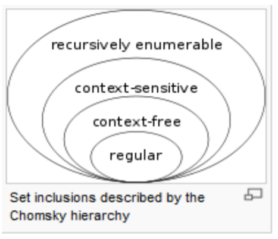
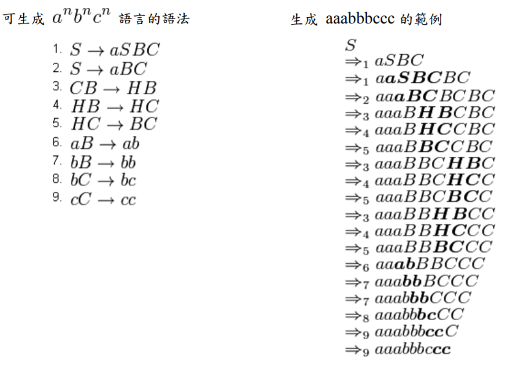

## 語法理論

不管是程式語言或自然語言，都可以用語法進行描述。但不同的是，程式語言的語法是設計者自行定義的，所以凡是不符合語法的程式都會直接被視為錯誤的程式。而在處理自然語言的時候，凡是文章中的句子，不管合不合語法，你的程式都要能夠處理。這是自然語言處理之所以困難的原因之一。

規則比對法是早期的自然語言研究重心，這個方法企圖利用語言知識庫處理機器翻譯的問題。其主要的核心理念來源於 Chromsky 的生成語法路線，Chromsky 考察語言的結構後，提出一套使用語法規則描述語句結構的的方法，稱為』生成語法」。許多學習外語的人都曾經學習過文法的概念，Chromsky所謂的語法與這些文法其實是類似的。

以下就讓我們來看看「語法」在「程式語言」與「自然語言」中的角色各自為何吧！

### 語言的層次

不論是以上哪些語言，幾乎都具有「詞彙、語句、文章」等三個層次，以下是這幾個層次的範例。

如果將各個層次分開處理，那麼語言的處理就可以分為：

1. 詞彙掃描 : 詞彙層次
2. 語法剖析 : 語句層次
3. 語意解析 : 文章層次
4. 語言合成 : 回應階段，將《詞彙》組合成《語句》、再將《語句》組合成《文章》呈現出來！

舉例而言，一個翻譯系統就需要具備《整合以上四項處理的能力》！

### Chomsky Hierarchy (喬姆斯基語言階層）

那麼、生程與法的描述能力到底如何呢？Chomsky 提出了一個很完整的答案，稱為 Chomsky Hierarchy (喬姆斯基語言階層），如下所示。

上圖中、 $`\alpha, \beta`$ 可以是任何語句 (含終端與非終端符號)，而 A, B 代表只能是非終端符號，a 代表只能是終端符號。其中 Type-0 的語言描述力是最強的，基本上任何的語法規則您都可以撰寫而毫無限制，這種語言所能描述的語言稱為「遞歸可枚舉語言」 (Recursive Enumerable , RE)，這種語言的能力在計算理論上可以對應到圖靈機，也就相當於是一台記憶體空間沒有上限的電腦所展現的能力。

Type1 語言的語法有點限制，因為每個規則的左邊至少要有一個非終端項目 A，但其前後可以連接任意規則，這種語法所能描述的語言稱為「對上下文敏感的語言」 (Context-Sensitive)，因為 可以決定之後到底是否要接 ，所以前後文之間是有關係的，因此才叫做「對上下文敏感的語言」。這種語言在計算理論上可以對應到「線性有界的非決定性圖靈機」，也就是一台「記憶體有限的電腦」。

Type 2 語言的語法限制更大，因為規則左邊只能有一個非終端項目 (以 A 代表)，規則右邊則沒有限制這種語言被稱為「上下文無關的語言」(Context Free) ，在計算理論上可以對應到 「非決定性的堆疊機」(non-deterministic pushdown automaton)。

幾乎所有的程式語言都屬於 Type 2 的「上下文無關的語言」，這樣的程式語言處理起來也會比較簡單。但是雖然程式語言在語法上通常屬於 Type 2 的「上下文無關」的語言，但其變數的型態與宣告等語意結構，卻是與上下文有關的，只是這個結構的處理通常是在「語意」層次去處理，而非在語法層次去處理的。

我們所常用的自然語言語法，像是「英文文法」、「中文文法」通常也是屬於 Type 2 的語法，但是自然語言中的「指稱」，像是「你、我、他」，以及許多「語意」上的問題，也都是與上下文有關的，無法單純以 Type 2 的語法處理這些特性。

> 事實上程式語言並非完全與上下文無關的，只是 BNF 語法是與上下文無關的語言而已，但在「變數宣告、型態相容性、物件、結構、函數宣告」等項目上，程式的區塊是與上下文有關的。但是這個相關性並不需要在語法的層次解決，而是留待語意層次再去解決就可以了，所以我們通常還是用 Type 2 的語法去描述程式語言。

Type 3 的語法限制是最多的，其規則的左右兩邊都最多只能有一個非終端項目 (以 A, B 表示) ，而且右端的終端項目 (以 a 表示) 只能放在非終端項目 B 的前面。這種語言稱為「正規式」(Regular)，可以用程式設計中常用的「正規表達式」(Regular Expression) 表示，對應到計算理論中的有限狀態機(Finite State Automaton)。

下圖是這些語言階層之間的包含關係:

Type2 所不能處理的語言當中，有個最著名的範例是 $`a_nb_nc_n`$ ，由於這當中 abc 三個字母必須按照順序各出現 n 次，而 Type2 的與上下文無關語法，無法記憶到底已經產生了幾個 ，所以也就無法產生出這樣的語言了。

以下的 Type 1 語法可以生成 語言，只是結構相對複雜而已，以下是一個可以生成aaabbbccc 的案例： 

