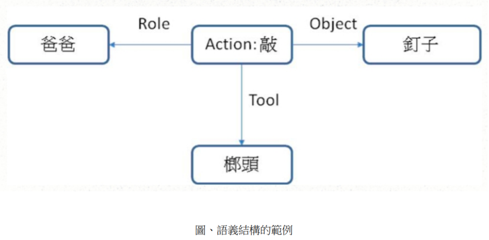

## 格狀語法 (Case Grammar)

在語法理論當中，有一個較為特別且受注目的語法學派，這個學派並不使用生成語法進行剖析，而是採用意義導向式的語法，直接支解句子當中的元素。這個學派沒有固定的名稱，其語法通常稱為 Case Grammar (中文稱為格狀語法、或格變語法) 、Semantic Role (語意角色語法)、或 Conceptual Dependency (概念依存語法)。在本書當中，我們以格狀語法統稱之。

格狀語法通常不需要先進行剖析，程式會跳過剖析的階段，直接採用物件導向式的方式，根據語意規
則比對的方式進行理解。

格狀語法是以角色與動作為核心的語法，例如，主角通常稱為 Role，動作通常稱為 Action，物體通常稱為 Object，而工具稱為 Tools。如此，以下的語法規則 1 就非常的具有語意上的抓取能力。

語法規則 1：Role Action Object by Tools

舉例而言，『爸爸用榔頭敲釘子』這個句子經過『理解』之後，就會建構出下列圖狀結構。

很明顯的，這樣的語法會以動詞 Action 為核心，而主角 Role、工具 Tool 與目標物 Object 都是該動作上的一個角色。這種強調動作語意的語法結構，對語意的『理解』會比生成語法直接。因此，通常被用在交談式系統的設計上，以避開剖析的困難，直接處理語意問題。

### 欄位填充機制

其實，格狀語法感覺並不像是一種語法，而是一種圖形表達結構。為了將語句對應到格狀語法，必須採用某種方法，可以將詞彙填入到這些格子 (Case) 當中，這種方法就稱為欄位填充機制。

以下是一個格狀語法填充的範例，讓我們先看看使用的語法規則。

語法規則：Role(動物) Action(咬) Object(動物 or 物品) by Tools(牙齒)

語句範例：那隻狗咬了穿紅衣服的女人，牙齒血淋淋的！

字典紀錄：狗:Animal, 人：People, People:Animal

屬性比對：那隻「狗 (Animal)」 「咬」了穿紅衣服的女「人 (People:Animal)」，牙齒血淋淋的！

標示欄位：那隻「Role:狗 (Animal)」 「Action:咬」了穿紅衣服的女「Object:人 (People:Animal)」，牙齒血淋淋的！

如果可以搭配與法剖析的機制，那麼就可能更進一步的將填充結果提升到名詞子句 (NP) 的層次，得到：

填充結果：Role(動物:那隻狗) Action(咬了) Object(動物:人:穿紅衣服的女人) by Tools(牙齒?)

於是如果我們對電腦進行閱讀測驗考試，問電腦「那隻狗咬了誰？」時，電腦就有可能回答「穿紅衣
服的女人」。而詢問「誰咬了穿紅衣服的女人」的時候，電腦也有辦法回答「是那隻狗」。甚至是詢
問「那隻狗用甚麼咬了女人」時，電腦也可以根據欄位填充結果，回答「應該是用牙齒」。

### 文章與劇本 (Script)

以上的格狀規則「Role Action Object by Tools」可以適用於很多的語句，但是卻很難描述更上層的複雜概念，像是「故事、小說、新聞、天氣預報」等等，因此研究者發展出了一種處理更高層語意結構的概念，稱為劇本 (Script) 。

那麼，甚麼是劇本呢？讓我們以「結婚」為例子，來看看一個典型的劇本。

> 男人 愛 女人=> 男人 女人 交往 => 男人 女人 結婚 => 男人 女人 交配 => 女人 生 小孩 => 小孩長大 => 外遇[男人 (交配|愛) 另一個女人] => 女人 發現 這件事 => 男人 女人 離婚

像這樣的故事我們經常聽到，連續劇與電影裏也經常上演，真實生活更是有無數的案例存在，所以當
我們想要讓電腦「理解」這種故事的時候，最簡單的方法就是先準備好這樣的劇本，然後當電腦一邊
解析文章的時候，就一邊比對文章的語句，看看目前進展到哪一個階段，每個人所扮演的角色各自為
何者等等。

舉例而言，假如電腦正在解析一篇文章，其內容如下：

> 約翰與瑪莉是大學的同班同學，在大三時約翰愛上了瑪莉，畢業後他們就結婚了，並且生了一個小男孩麥克。
> 約翰畢業後進入一家大公司工作，由於表現良好，所以被拔擢為經理，妮可是他的秘書。由於工作上朝夕相處，以致約翰與妮可日久生情。
> 當瑪莉發現約翰與妮可的外遇事件後，她決定離婚，並且取得了麥克的監護權。而兩人離婚之後不久，約翰與妮可就結婚了。

於是，如果我們使用上述劇本去解析比對這篇文章，就可能得到下列的結果：

> 約翰與瑪莉是大學的同班同學，在大三時 (約翰：男人) (愛)上了 (瑪莉：女人)，畢業後(他們:男人,女人) 就 (結婚) 了，並且(生)了一個 (小男孩麥克:小孩)。
> 約翰畢業後進入一家大公司工作，由於表現良好，所以被拔擢為經理，妮可是他的秘書。由於工作上朝夕相處，以致 (約翰：男人) 與 (妮可：女人) 日久生情。
> 當瑪莉發現(約翰：男人)與(妮可：女人) 的(外遇)事件後，(她:女人) 決定 (離婚)，並且取得了麥克的監護權。而兩人離婚之後不久，約翰與妮可就結婚了。

於是透過這樣的「高層欄位填充機制」，電腦稍微能掌握到故事的發展進度與結構，而這正是劇本
(Script) 所產生的效果。

