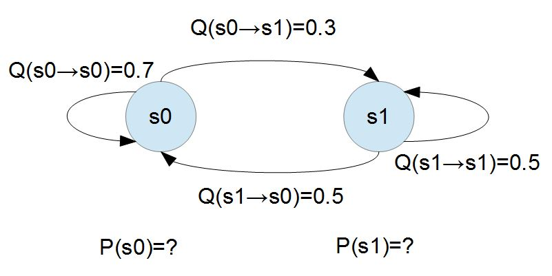

## Gibbs 演算法

如前所述、我們可以用 Gibbs 演算法，在已知「轉移矩陣」的情況下求解「每個狀態的平衡機率值」，我們將用下圖這個只有兩個狀態的馬可夫系統為例，將「Gibbs 演算法」轉換為實際的 JavaScript 程式，讓讀者透過程式實際體會 Gibbs 演算法的原理。



### 程式範例

現在、我們希望用 Gibbs 演算法來尋找上述問題的穩態，一開始我們可以隨意設定一個初始的隨機分布，例如 (P0, P1) = (0.5, 0.5)。

接著我們就可以用疊代的方法，計算該系統的穩態，以下的 JavaScript 程式就模擬了這種過程。

檔案： gibbs.js

```javascript
// Gibbs Algorithm 的範例
// 問題：機率式有限狀態機，P(s0=>s1)=0.3, P(s1=>s0)=0.5 ; P(s0=>s0)=0.7, P(s1=>s1)=0.5
// 目標：尋找該「機率式有限狀態機」的穩態，也就是 P(s0) = ?, P(s1)=? 時系統會達到平衡。

function rand(a, b) {
  return (b-a)*Math.random() + a;
}

function gibbs() {
  var P = [ 0.5, 0.5 ]; // 初始機率分佈，隨意設定。
  var Q = [ [0.7, 0.3], [0.5, 0.5] ];
  do {
	console.log("P = %j", P);
    var Pn = [ P[0]*Q[0][0]+P[1]*Q[1][0], P[0]*Q[0][1]+P[1]*Q[1][1] ];    // 下一輪的機率分布。
	var diff = [ Pn[0]-P[0], Pn[1]-P[1] ];                // 兩輪間的差異。
	var step = Math.sqrt(diff[0]*diff[0]+diff[1]*diff[1]);// 差異的大小
	P = Pn;
  } while (step > 0.001);  // 假如差異夠小的時候，就可以停止了。
  console.log("5/8=%d 3/8=%d", 5/8, 3/8); // 印出標準答案，以便看看我們找到的答案是否夠接近。
}

gibbs();
```

執行結果：

```
D:\Dropbox\Public\web\ml\code\Gibbs>node gibbs.js
P = [0.5,0.5]
P = [0.6,0.4]
P = [0.62,0.38]
P = [0.624,0.376]
P = [0.6248,0.3752]
5/8=0.625 3/8=0.375
```

您可以看到上述程式所找到的答案 [0.6248,0.3752] 與我們用「聯立方程式」求出來的答案 [5/8, 3/8] 之間非常接近，這代表上述的 Gibbs 程式可以求出系統的穩態。

當然、上述的算法只是一個極度簡化的範例，還不能完全代表 Gibbs Algorithm，現在讓我們用比較抽象但通用的講法來說明 Gibbs 演算法。

### 數學描述

Gibbs 取樣程序的使用時機是在聯合分布 P(X,Y) 未知，但是單一變數的條件機率 $Q(X \to Y), Q(Y|X), P(X), P(Y) 已知的情況。在此種情況下，我們可以利用亂數產生的樣本，統計聯合機率分布。

該程序首先取得一個分布 Y0 作為初始值，然後利用蒙地卡羅法透過 (X, Y0) 產生 X1 分布，接著再利用 (X1, Y)  產生 Y1 分布。於是我們得到下列這個疊代程序 

```
Algorithm GibbsSampling(X, Y)
　Y[0] = random initialize a distribution
　for i = 1 to N
　　generate X[i] from Y[i-1] and Q(Y[i-1]→X)
　　generate Y[i] from X[i] and Q(X[i]→Y) 
　return {X[N], Y[N]}
End Algorithm
```

以上疊代程序是針對兩個隨機變數的情況，假如我們希望延伸到 k 個隨機變數的情況，可以修改演算法如下。

```
Algorithm GibbsSampling(X[1...k])
　X = random initialize a distribution
　for i = 1 to N
　　generate X'[1] from X and Q(X[2], ..., X[k] → X[1])
    ...
　　generate X'[j] from X and Q(X[1], ..., X[j-1], X[j+1],...,X[k] → X[i])
    ...
　　generate X'[k] from X and Q(X[1], ..., X[k-1] → X[k])
    X = X'
  end
　return X
End Algorithm
```

Gibbs 取樣程序是『蒙地卡羅馬可夫算法』(MCMC) 的一個案例，也是 Metropolis-Hasting 取樣程序的一個特例，我們可以利用 Gibbs 或 Metropolis-Hasting 取樣程序計算貝氏網路的聯合機率分布。

### 參考文獻

* [Wikipedia:Gibbs Sampling](http://en.wikipedia.org/wiki/Gibbs_sampling)
* 3.4 The Gibbs Sampling Algorithm, <http://sfb649.wiwi.hu-berlin.de/fedc_homepage/xplore/ebooks/html/csa/node28.html>
* Handbook of Computational Statistics - <http://sfb649.wiwi.hu-berlin.de/fedc_homepage/xplore/ebooks/html/csa/csahtml.html>


