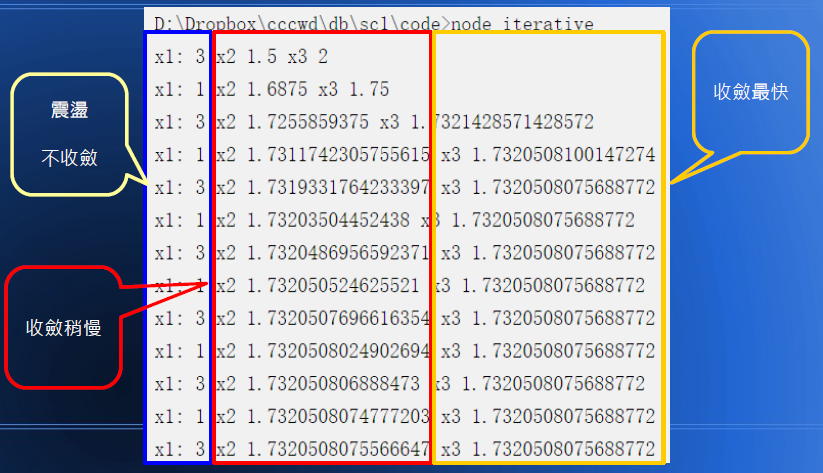

# 迭代法 Iterative 

## 迭代法

話說《迭代法》，感覺非常神奇，但是說穿了很簡單！

迭代法的關鍵，可以說是一種《函數不動點》的尋找，也就是尋找符合條件 x=f(x) 的 x 值。

透過反覆計算 x[k+1] = f(x[k]) 的方式，假如最後達到收斂，那麼我們就知道該 x 值會是 x=f(x) 的解答。

以下是迭代法的計算過程：

```
x2 =f(x1)
x3 =f(x2)
... 
x[k+1] =f(x[k])
```

所謂的不動點，就是 x=f(x) 這樣一個方程式。我們從 k=0 開始反覆用 x[k+1] =f(x[k]) 去找下一個 x[k+1]，當我們找到符合 x[k+1] =f(x[k]) 的 x 時， x 基本上就定住了，這時我們找到的 x 就是 x=f(x) 的一個解答！

問題是，如果我們並非想找 f(x)=x 的解，而是 f(x)=0 的解呢？ 那該怎麼辦？

其實答案很簡單， 只要修改方程式，想辦法讓 x 出 現在其中一邊就行了。

舉例而言， 假如我們想要找 f(x)=0 的解， 那麼我們可以對兩邊各加一個 x ，變成 f(x)+x = x 該等式仍然會成立。這樣就可以進行迭代了！

當然、迭代的形式不只一種， 對於 f(x)=0，以下都是可以用的迭代形式。

```math
&= x=f(x)+x \\

x^2=f(x)+x^2 => &= x=(f(x)+x^2)/x \\

3x^3=f(x)+3x^3 => &= x=(f(x)+3x^3)/(3x^2) \\

f(x)/4=0 => &= x= x-f(x)/4
```

於是、您只要選擇一個起點， 像是 x=3 ，然後開始反複套用迭代公式，看看是否會收斂就行了！

假如我們的迭代公式是 x=g(x)，那麼只要隨便選一個起點，例如 x1=3，然後用 x2 =g(x1)，x3=g(x2) … 一直算下去，直到收斂為止。

以下是一個迭代法的程式範例， 用來尋找 `x*x-4*x+1` 的解！

```javascript
function f(x) { return x*x-4*x+1; }

function g(x) { return x-f(x)/4; }

function isolve(g, x) {
  console.log("x=", x);
  for (var i=0; i<100000; i++) {
    if (Math.abs(x-g(x)) < 0.001)
      return x;
    x = g(x);
    console.log("x=", x);
  }
  return x;
}

var x = isolve(g, 1)
console.log("x=", x, "f(x)=", f(x))
```

執行結果：

```
$ node iteration.js
x= 1
x= 1.5
x= 2.1875
x= 2.9287109375
x= 3.4630849361419678
x= 3.6779305535505813
x= 3.7240678179159414
x= 3.7309653577225825
x= 3.7309653577225825 f(x)= -0.0037589303643326133
```

這種迭代法，其實幾乎可以用來解所有的方程式，最大的問題是《可能不會收斂》！，

而且不同的迭代方法，收斂速度也常 常有差異

在此我們舉一個簡單的例子， 假如您想求某個數 n 的平方根。那麼可以用下列三種的迭代算式

1. $`3/x = 3/x`$
2. $`x_{k+1} = x_k - \frac{1}{4} (x^2_k -3)`$
3. $`x_{k+1} = \frac{1}{2} (x_k + \frac{3}{x_k})`$

然後實作這三種方法，程式碼如下：

檔案： iterative3.js

```javascript
var f1 = (x) => 3 / x
var f2 = (x) => x - 1 / 4 * (x * x - 3)
var f3 = (x) => 1 / 2 * (x + 3 / x)

var x1, x2, x3
x1 = x2 = x3 = 1
for (var i = 0; i < 20; i++) {
  x1 = f1(x1);  x2 = f2(x2); x3 = f3(x3)
  console.log('x1:', x1, 'x2', x2, 'x3', x3)
}
```

執行結果

```
$ node iterative3
x1: 3 x2 1.5 x3 2
x1: 1 x2 1.6875 x3 1.75
x1: 3 x2 1.7255859375 x3 1.7321428571428572
x1: 1 x2 1.7311742305755615 x3 1.7320508100147274
x1: 3 x2 1.7319331764233397 x3 1.7320508075688772
x1: 1 x2 1.73203504452438 x3 1.7320508075688772
x1: 3 x2 1.7320486956592371 x3 1.7320508075688772
x1: 1 x2 1.732050524625521 x3 1.7320508075688772
x1: 3 x2 1.7320507696616354 x3 1.7320508075688772
x1: 1 x2 1.7320508024902694 x3 1.7320508075688772
x1: 3 x2 1.732050806888473 x3 1.7320508075688772
x1: 1 x2 1.7320508074777203 x3 1.7320508075688772
x1: 3 x2 1.7320508075566647 x3 1.7320508075688772
x1: 1 x2 1.7320508075672412 x3 1.7320508075688772
x1: 3 x2 1.7320508075686583 x3 1.7320508075688772
x1: 1 x2 1.7320508075688479 x3 1.7320508075688772
x1: 3 x2 1.7320508075688732 x3 1.7320508075688772
x1: 1 x2 1.7320508075688767 x3 1.7320508075688772
x1: 3 x2 1.7320508075688772 x3 1.7320508075688772
x1: 1 x2 1.7320508075688772 x3 1.7320508075688772
```

這三種方法的收斂情形如下圖：



因此、好的迭代算式可以讓你上天堂，不好的迭代算式會讓你住牢房！

如果想要確定迭代法會收斂， 必須要好好的設計《迭代函數》 與《初始值》才行！

當然、有人可能會問， 假如我想解的不是方程式，而是像下列的這種《方程組》的話，那該怎麼辦呢？


其實這個問題， 只要稍微轉換一下，就可以讓 《方程組變成單一的方程式》

假如您想求解下列方程組

```
  f(x)=0
  g(x)=0
```

那麼只要改寫為


$`f^2(x) +g^2(x) = 0`$

就可以《將方程組變成方程式》了。

只是這樣一來，線性的方程組就有可能變成了 《二次的非線性方程式》

這就是，用解方程式的方法來解方程組，所需要付出的代價了。

不過迭代法確實是一個，很好的《數值方法》 可以用來解很多方程式。


## 結語

您可以看到迭代法可以用來求方程式的解，也可以用來尋找馬可夫鏈的平衡機率，當然還有很多領域的問題，都可以用迭代法來解決。

例如 EM 演算法，就是用迭代法來求最大機率模型的方法。

另外還有 KMEAN 演算法，則是用迭代進行機器學習的方法。


