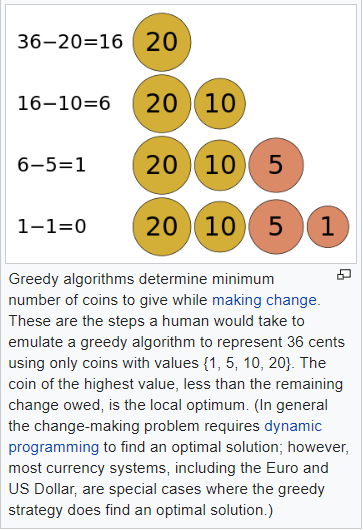
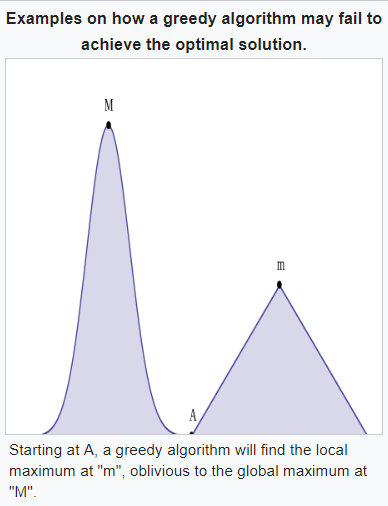
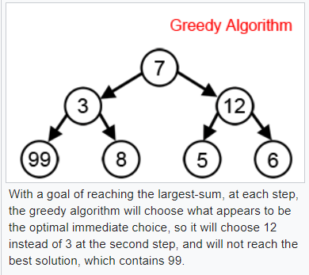

# 貪婪演算法 Greedy Algorithm

『貪婪演算法』每次都會往目前看到最好的方向走去，而且盡量選取改善最多的那一步。

## 找零錢問題

舉例而言，若你買東西給了紙鈔，那麼能否寫一個程式自動計算應該『找多少零錢』，而且要盡量讓『找錢的銅板數量愈少愈好』？

這個問題可以用『貪婪算法』，從小於『剩餘金額』的最大類型銅板開始找起，因為這樣找一個零錢就可以『解決最多的剩餘金額』，所以是一種貪婪策略！

以下是這個問題的想法圖示！




## 貪婪爬山法

我們也可以用『貪婪算法』來完成『爬山演算法』的動作，原本爬山演算法只要看到更高就往那邊爬，但是貪婪算法則要往『斜率最大的方向爬』。



上圖是二維平面，看不太出『貪婪算法』與爬山演算法的差別，假如是『三維圖形』時，那麼『貪婪算法』就會變得和『梯度爬山法』一樣，總是朝著斜率最大的方向爬去。

## 貪婪圖形搜尋

對於 Graph 類的結構，我們也可以用『貪婪算法』來處理，每次都向下一層中最好的分支走去。




## 最小擴展樹

檔案： minimalSpanningTree.js

```js
// See http://en.wikipedia.org/wiki/Kruskal's_algorithm
// and http://programmingpraxis.com/2010/04/06/minimum-spanning-tree-kruskals-algorithm/

var nodes = ["A", "B", "C", "D", "E", "F", "G"]
var edges = [
    ["A", "B", 7], ["A", "D", 5],
    ["B", "C", 8], ["B", "D", 9], ["B", "E", 7],
    ["C", "E", 5],
    ["D", "E", 15], ["D", "F", 6],
    ["E", "F", 8], ["E", "G", 9],
    ["F", "G", 11]
];


function minimalSpanningTree(nodes, edges) {
  var mst = [], nodeSet = {}
  for (let node of nodes) {
    nodeSet[node] = [node]
  }
  let sortedEdges = edges.sort((a,b) => a[2] - b[2])
  for (let edge of sortedEdges) {
    var n1 = edge[0], n2 = edge[1]
    var t1 = nodeSet[n1]    
    var t2 = nodeSet[n2]
    if (t1 != t2) {
      var t = t1.concat(t2)
      nodeSet[n1] = nodeSet[n2] = t
      mst.push(edge)
      if (mst.length == nodes.length-1) break
    }
  }
  return mst
}

console.log(minimalSpanningTree(nodes, edges))
```

執行結果：

```
$ node minimalSpanningTree.js
[ [ 'C', 'E', 5 ],
  [ 'A', 'D', 5 ],
  [ 'D', 'F', 6 ],
  [ 'A', 'B', 7 ],
  [ 'B', 'E', 7 ],
  [ 'B', 'C', 8 ] ]
```

## 霍夫曼編碼法

檔案: HuffmanCode.js

```js
// 程式修改自 -- https://gist.github.com/1995eaton/86f10f4d0247b4e4e65e

// 參考 -- https://en.wikipedia.org/wiki/Binary_heap
/* 堆積：
插入節點: 在陣列的最末尾插入新節點。然後自下而上調整子節點與父節點（稱作 bubble-up 或 sift-up）
         比較當前節點與父節點，不滿足「堆積性質」則交換。從而使得當前子樹滿足二元堆積的性質。
         時間複雜度為 O(log n)。
刪除樹根：刪除時，把堆積儲存的最後那個節點移到填在根節點處。再從上而下調整父節點與它的子節點。
*/
class Heap { // 堆積結構 Heap
  constructor (fn) {
    this.fn = fn    // fn 會取得排序欄位值
    this.items = [] // items 為存放堆積的陣列
  }
  swap(i, j) {
    let t = this.items[i]
    this.items[i] = this.items[j]
    this.items[j] = t
  }
  bubble(index) { // 冒泡調整，將大的往上調
    var parent = ~~((index - 1) / 2)
    if (this.item(parent) < this.item(index)) {
      this.swap(index, parent)
      this.bubble(parent)
    }
  }
  item(index) {
    return this.fn(this.items[index])
  }
  pop() {
    return this.items.pop()
  }
  sift(index, end) {
    var child = index * 2 + 1
    if (child < end) {
      if (child + 1 < end && this.item(child + 1) > this.item(child)) {
        child++
      }
      if (this.item(index) < this.item(child)) {
        this.swap(index, child)
        return this.sift(child, end)
      }
    }
  }
  push() {
    var lastIndex = this.items.length
    for (var i = 0; i < arguments.length; i++) {
      this.items.push(arguments[i])
      this.bubble(lastIndex++)
    }
  }
  length() {
    return this.items.length
  }
}

var Huffman = {
  encode: function(data) {
    var prob = {}
    var tree = new Heap((e)=>e[0])
    // 計算每個字出現的頻率
    for (var i = 0; i < data.length; i++) {
      if (prob.hasOwnProperty(data[i])) {
        prob[data[i]]++
      } else {
        prob[data[i]] = 1
      }
    }
    // 將整個陣列順序打亂，然後放進堆積中（節點：以 [出現次數, 字元] 的方式儲存。
    Object.keys(prob).sort((a, b) => ~~(Math.random() * 2))
                     .forEach((e) => tree.push([prob[e], e]))
    while (tree.length() > 1) { // 當還沒有全部形成一棵樹 （還有很多棵）的時候
      var first = tree.pop(), second = tree.pop()              // 取出頻率最小的兩個
      tree.push([first[0] + second[0], [first[1], second[1]]]) // 將兩者合併成一個
    }
    // 上面迴圈完成後，樹已經建好了，開始進行編碼！
    var dict = {}
    var recurse = function(root, string) {
      if (root.constructor === Array) {
        recurse(root[0], string + '0') // 左邊為 0 
        recurse(root[1], string + '1') // 右邊為 1
      } else {
        dict[root] = string // 已經到樹葉節點，設定該字元的編碼。
      }
    }
    tree.items = tree.pop()[1] // 取得樹根
    recurse(tree.items, '') // 對樹上每個節點進行編碼
    var result = ''
    for (var i = 0; i < data.length; i++) {
      result += dict[data.charAt(i)] // 對每個字元編碼後加入結果的 0101.... 字串
    }
    return {emap:dict, result:result}
  },
  decode: function(h) {
    var data = h.result.split(''), dmap = {}
    // 將 emap(ch)=>binary 反轉為 dmap(binary)=>ch    
    for (let ch in h.emap) {
      let binary = h.emap[ch]
      dmap[binary] = ch
    }
    var result = ''
    while (data.length) {
      var i = 0, cur = ''
      while (data.length) {
        cur += data.shift()
        if (dmap.hasOwnProperty(cur)) { // 查查看這個長度的二進位是否在 dmap 中
          result += dmap[cur] // 有的話就進行編碼
          break
        }
      }
    }
    return result
  }
}

var enc = Huffman.encode('TESTTESTTESTTESTTESTTESTTESTTEST123abc')
console.log('encode=', enc)
var dec = Huffman.decode(enc)
console.log('decode=', dec)
```

執行結果

```
$ node huffmanCode.js
encode= { emap:
   { '1': '10001',
     '2': '1000001',
     '3': '1000000',
     T: '0',
     a: '100001',
     b: '10010',
     c: '10011',
     S: '101',
     E: '11' },
  result: '0111010011101001110100111010011101001110100111010011101010001100000110000001000011001010011' }
decode= TESTTESTTESTTESTTESTTESTTESTTEST123abc
```

## 結語

對於『找零錢，霍夫曼編碼法，最小擴展樹』這類的問題而言，『貪婪算法』是可以找到最佳解的！

但是對於其他問題，每次都貪婪的走，並不見得能找到整體最好的結果，甚至有時候結果會很差，因此是否要用貪婪算法，得視問題而定。

## 參考

* https://en.wikipedia.org/wiki/Greedy_algorithm