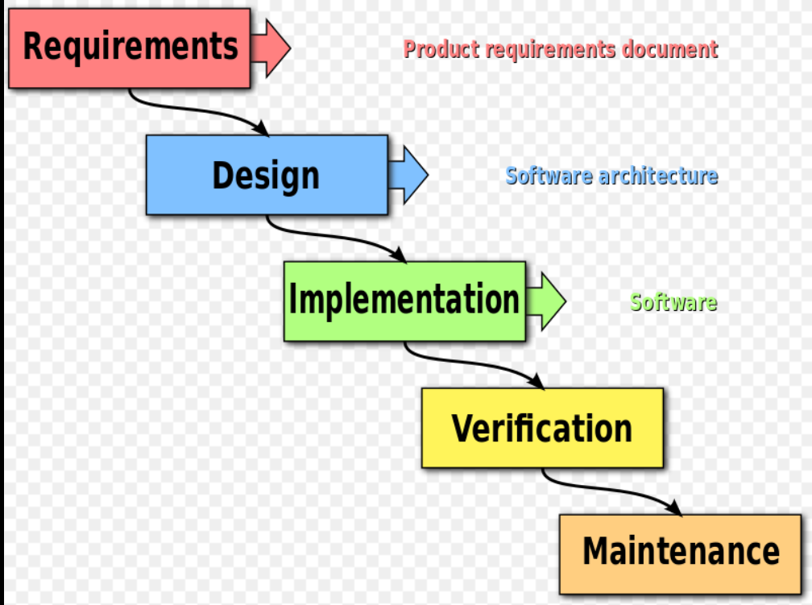
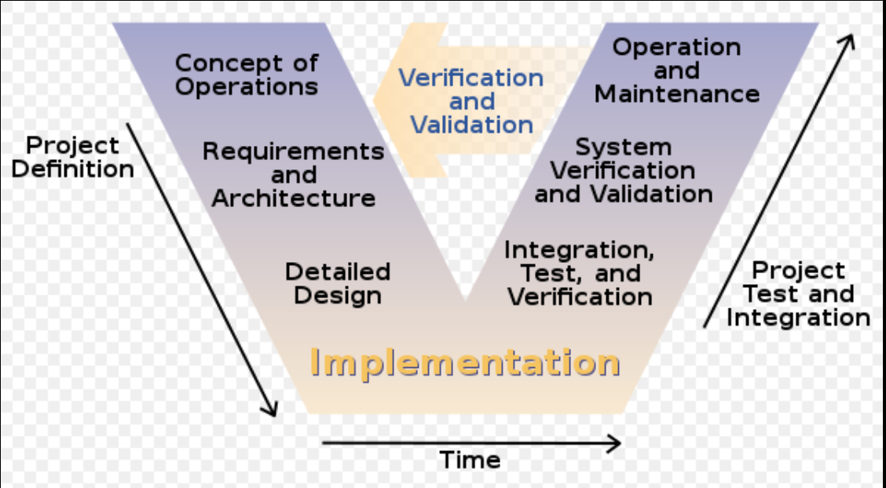
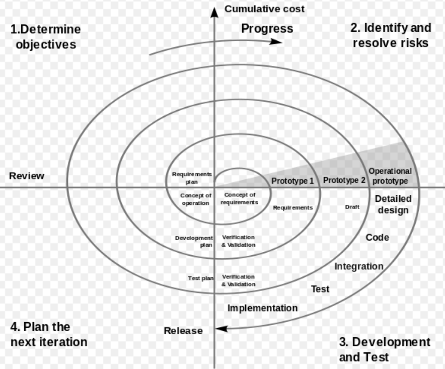
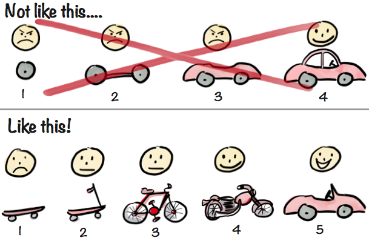
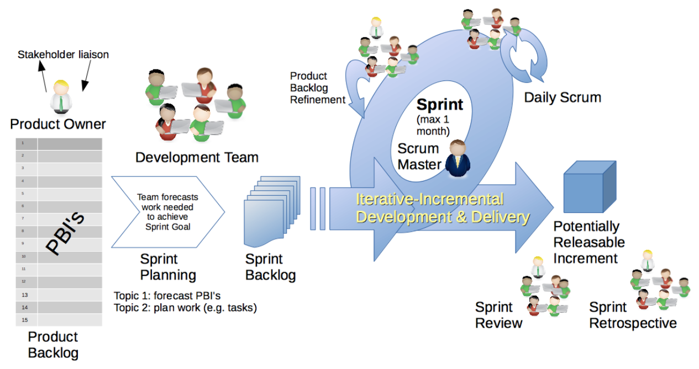
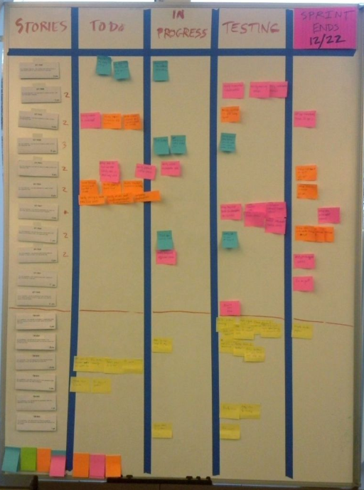
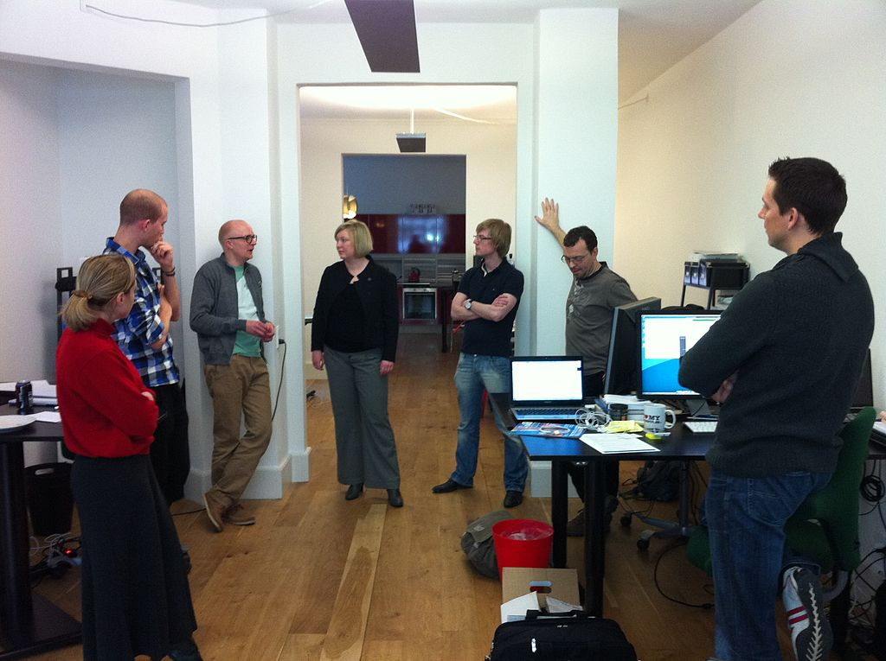
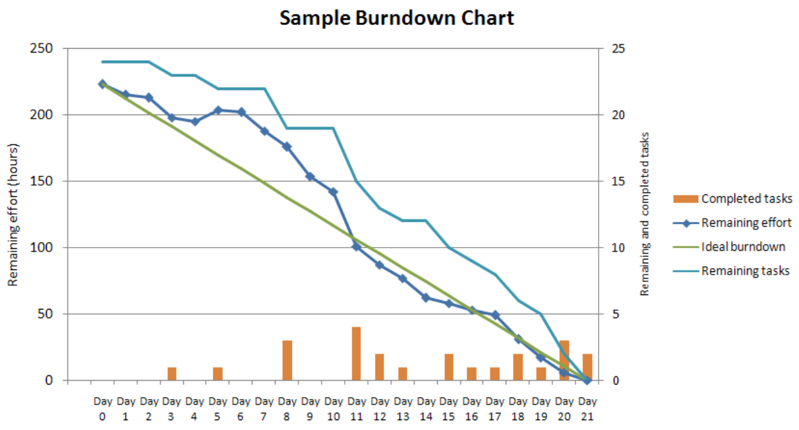
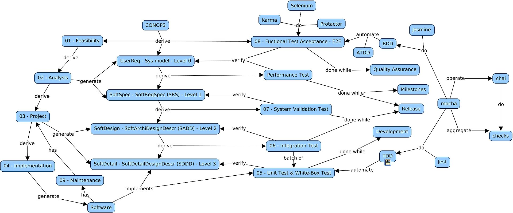
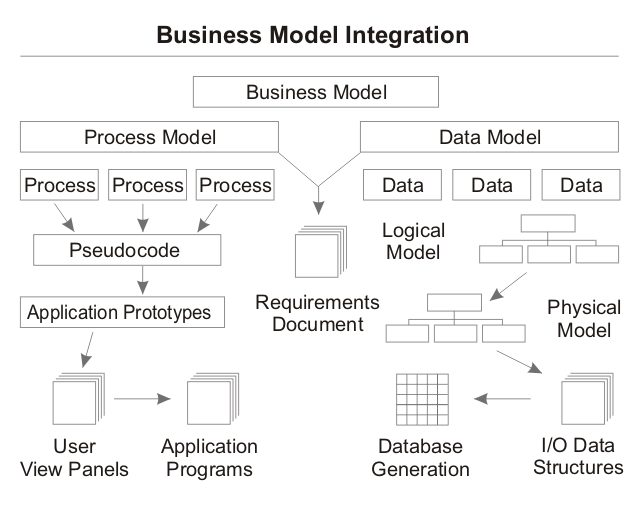

# 第 6 章 -- 軟體專案

## 簡介

軟體工程的方法有很多方面的意義。包括專案管理，分析，設計，程式的編寫，測試和品質控制。

## 軟體開發模式

軟體開發方法可以區別為重量級的方法和輕量級的方法。

重量級的方法中會產生大量的正式文件，像是 ISO 9000，CMM，和統一軟體開發過程（RUP）等，都要求要有完整的文件。

輕量級的開發過程，像是敏捷開發 (Agile)，就認為《可用的軟體重於詳盡的文件》，希望不要為了《正式好看》而過度撰寫文件。

根據《新方法學》這篇文章的說法，重量級方法呈現的是一種「防禦型」的姿態。在應用「重量級方法」的軟體組織中，由於軟體專案經理不參與或者很少參與程式設計，無法從細節上把握專案進度，因而會對專案產生「恐懼感」，不得不要求程式設計師不斷撰寫很多「軟體開發文件」。而輕量級方法則呈現「進攻型」的姿態，這一點從XP方法特別強調的四個準則—「溝通、簡單、回饋和勇氣」上有所體現。目前有一些人認為，「重量級方法」適合於大型的軟體團隊（數十人以上）使用，而「輕量級方法」適合小型的軟體團隊（幾人、十幾人）使用。當然，關於重量級方法和輕量級方法的優劣存在很多爭論，而各種方法也在不斷進化中。

一些方法論者認為人們在開發中應當嚴格遵循並且實施這些方法。但是一些人並不具有實施這些方法的條件。實際上，採用何種方法開發軟體取決於很多因素，同時受到環境的制約。

> 進階閱讀： [維基百科: 軟體工程](https://zh.wikipedia.org/wiki/%E8%BD%AF%E4%BB%B6%E5%B7%A5%E7%A8%8B)

在1986年，IBM大型電腦之父佛瑞德·布魯克斯發表了他的著名論文《沒有銀彈》，在這篇著名的論文中他斷言：「在10年內無法找到解決軟體危機的靈丹妙藥」。從軟體危機被提出以來。人們一直在尋找解決它的方法。於是一系列的方法被提出並且加以應用。比如結構化程式設計，面向對象的開發，CMM，UML等等。佛瑞德·布魯克斯著名作品還有《人月神話》。

布魯克斯在《人月神話：軟體專案管理之道（The Mythical Man-Month）》提到，將沒有靈丹妙藥（silver bullet）可以一蹴而就，開發軟體的困難是內生的，只能漸進式的改善。整體環境沒有改變以前，唯一可能的解，是依靠人的素質，培養優秀的工程師。

雖然沒有完美的方法與模式，但是瞭解這些方法還是對軟體開發有幫助的，以下我們精選出幾個具有代表性的軟體開發方法

1. 瀑布模式
2. V 模式
3. 螺旋模式
4. 快速雛形
5. 敏捷開發

> 進階閱讀: 
> 1. [軟體開發模型- MBA智库百科](https://zh.wikipedia.org/wiki/%E7%80%91%E5%B8%83%E6%A8%A1%E5%9E%8B)
> 2. [維基百科 -- 軟體工程](https://zh.wikipedia.org/wiki/%E8%BD%AF%E4%BB%B6%E5%B7%A5%E7%A8%8B)

## 瀑布模式

瀑布模型（Waterfall Model）強調系統開發應有完整之週期，且必須完整的經歷週期之每一開發階段，並使用分析與設計的技術、估計時間與資源之投入等。

一個典型的瀑布模式開發，會分成《需求分析、系統設計、程式實作、測試驗證、上線維護》等等階段，如下圖所示。



> 進階閱讀: [維基百科 -- 瀑布模式](https://zh.wikipedia.org/wiki/%E7%80%91%E5%B8%83%E6%A8%A1%E5%9E%8B)

## V 模式

V 模式應該算是《瀑布模式》的一種《精細化作法》，把由上而下的《定義、分析、設計》過程，與由下而上的《測試、驗證、營運》階段對應起來，如下圖所示：



> 進階閱讀: [維基百科 -- V 模型](https://zh.wikipedia.org/wiki/V%E6%A8%A1%E5%9E%8B)

## 螺旋模式

螺旋模型由美國軟體工程師巴里·勃姆於1988年5月在他的文章《一種螺旋式的軟體開發與強化模型》提出。

螺旋模型並不是第一個討論疊代過程的模型。而它卻是第一個解釋疊代的重要作用的模型。

一個典型的螺旋模型應該由以下的步驟構成：

1. 明確本疊代階段的目標、備選方案以及應用備選方案的限制；
2. 對備選方案進行評估，明確並解決存在的風險，建立原型；
3. 當風險得到很好的分析與解決後，應用瀑布模型進行本階段的開發與測試；
4. 對下一階段進行計劃與部署；
5. 與客戶一起對本階段進行評審；



> 進階閱讀: [維基百科 -- 螺旋模式](https://zh.wikipedia.org/wiki/%E8%9E%BA%E6%97%8B%E6%A8%A1%E5%9E%8B)

## 敏捷開發

對真正的開發人員而言，上述的模式都太過厚重而難以實施，為了解決這樣的問題，於是一群開發者提出了《敏捷》(agile) 開發方法。

敏捷一詞來源於2001年初美國猶他州雪鳥滑雪聖地的一次敏捷方法發起者和實踐者（他們發起組成了敏捷聯盟）的聚會。

雪鳥會議共同起草了敏捷軟體開發宣言。其中最重要的部分就是對一些與會者一致同意的軟體開發價值觀的表述。其中包括了以下方針：

1. 個人與互動：重於流程與工具
2. 可用的軟體：重於詳盡的文件
3. 與客戶合作：重於合約協商
4. 回應變化：重於遵循計劃

參考： http://agilemanifesto.org/

雖然他們也很重視右邊的內容，但是更重視左邊的內容。相關術語的意思是:

* 個人和互動：自我組織和動機是重要的，像共同定位和雙人程式開發，這樣作業模式中的溝通是重要的。建立一個良好的溝通和協作的開發團隊，優於一個孤立運行的專家團隊。溝通是一個基本的概念。
* 工作軟體：工作軟體比在會議中向客戶呈現檔案更有用並更受歡迎。最好的做法是和程式碼一起評論，保持外部檔案的輕量化，而不是沉重的檔案，後者需要花費很大的精力，且很快就會過時。
* 客戶協作：在軟體開發週期的初始階段，需求無法完全收集，所以最好直接涉及到付費客戶、最終用戶或者代理，以便在回饋的基礎上逐步闡述和調整詳細的需求。
* 回應變化：敏捷軟體開發方法的重點是快速響應變化和持續發展。
一些軟體開發者組織了敏捷聯盟，為非營利組織，根據宣言的價值觀和原則促進軟體開發。吉姆·海史密斯（Jim Highsmith）代表敏捷聯盟（Agile Alliance）介紹宣言：

> 敏捷運動並不是反方法論，實際上我們很多人都想恢復對方法論的可信度。我們想恢復平衡。我們接受建模，但不是為了在塵土飛揚的企業存儲庫中提交一些圖表。 我們擁抱檔案，而不是數百頁從未維護和很少使用的檔案。 我們計劃，但要認識到動盪環境下的規劃極限。 那些將XP或SCRUM或者其他敏捷方法的支持者稱為「駭客」的人對於駭客術語的方法和原始定義都是無知的。

敏捷宣言中還包括以下原則：

* 我們最優先的任務，是透過及早並持續地交付有價值的軟體來滿足客戶需求。
* 竭誠歡迎改變需求，甚至已處開發後期亦然。敏捷流程掌控變更，以維護客戶的競爭優勢。
* 經常交付可用的軟體，頻率可以從數週到數個月，以較短時間間隔為佳。
* 業務人員與開發者必須在專案中經常一起工作。
* 以積極的個人來建構專案，給予他們所需的環境與支援，並信任他們可以完成工作。
* 面對面的溝通是傳遞資訊給開發團隊及團隊成員之間效率最高且效果最佳的方法。
* 可用的軟體是最主要的進度量測方法。
* 敏捷程序提倡可持續的開發。贊助者、開發者及使用者應當能不斷地維持穩定的步調。
* 持續追求優越的技術與優良的設計，以強化敏捷性。
* 精簡──或最大化未完成工作量之技藝──是不可或缺的。
* 最佳的架構、需求與設計皆來自於能自我組織的團隊。
* 團隊定期自省如何更有效率，並據之適當地調整與修正自己的行為。

一般來說，敏捷開發被認為對於少於12人的小團隊很有用，而 Rational RUP 較適合大型團隊。

敏捷開發宣言之後，各種敏捷開發方法逐漸被提出來，像是《極限編程（XP）、精益軟體開發 (Lean)、看板、Scrum》等方法論。

這些《敏捷開發方法》當中，有不少被業界逐漸應用在實務上，成為重要的開發手段，其中比較重要的有：

1. 結對編程 (Pair Programming)
2. 測試驅動 (TDD/BDD)
3. 持續整合 (Continuous Integration)
4. 軟體重構 (Refactor)
5. 開發運維一體化 (DevOps)

敏捷開發希望能透過《需求者與開發者》合作營造一種雙贏的狀況，也就是宣言中的《與客戶合作：重於合約協商》。

但是若採用傳統合約，客戶並不會經常甚至每天與開發團隊一起工作，而且客戶會試圖在一開始就規定鉅細靡遺的合約，這和敏捷開發的《彈性小週期疊代》方法是有衝突的，因此敏捷開發必須採用更敏捷的合約。

敏捷的方法通常每個 sprint 都會產生一個可佈署版本，如下圖所示：



* 圖片來源: Henrik Kniberg -- https://twitter.com/henrikkniberg/status/698071039151054848

> 進階閱讀： 
> 1. [採用敏捷方法的軟體開發合約該怎麼簽？](https://ihower.tw/blog/archives/2449)
> 2. [翻譯:敏捷已死](https://ndarkmsnlivespace.wordpress.com/2016/05/10/%E7%BF%BB%E8%AD%AF-%E6%95%8F%E6%8D%B7%E5%B7%B2%E6%AD%BB/)


## 團隊合作

敏捷開發除了探討《開發過程、工具與手段》之外，也強調了《團隊合作的方法》，以下是 Scrum 團隊的運作模式。



上圖將參與人員分為《產品負責人 Product Owner、開發團隊 Development Team 與 Scrum Master》等角色，其中 Scrum Master 的角色最難理解，您可以參考下文：

> 進階閱讀：
>  
> 1. [解惑 Scrum 系列一：什么是 Scrum Master？](https://blog.teambition.com/blog/agile-tool/scrum-one-scrum-master/)
> 2. [吳軍談敏捷開發](https://www.facebook.com/groups/179345672472/permalink/10156063840087473/)

Scrum Master 是 Scrum 教練和團隊帶頭人，確保團隊合理的運作Scrum，並幫助團隊掃除實施中的障礙；

如果要用一句話描述 Scrum Master 的話，那我會用《敏捷教練》 描述 .... (感覺有點怪怪的 ....)

Scrum 在每一次 Sprint (衝刺或疊代：一個15到30天的周期，其長度由開發團隊決定) 當中，開發團隊創建可用的（可以隨時推出）軟體的一個增量。每一個疊代所要實現的功能來自 Product Backlog (工作項目清單)。

Product Backlog 按照優先級排列工作需求。在疊代計劃會議中，產品負責人告訴開發團隊需有哪些項目待完成。開發團隊決定在下一個 Sprint 中要完成的項目 (稱為 Sprint Backlog)。

在一個 Sprint 開始之後，Sprint Backlog 是被凍結的，不能隨意修改，直到這個 Sprint 結束之後，才能在啟動下一次 Sprint 時重新決定 Sprint Backlog 。

這樣、Development Team 就不會因為開發過程中工作項目不斷修改而產生困擾。

而 Product Owner 也可以在每個 Sprint 啟動時，和Development Team 討論並決定下一個 Sprint Backlog 要開發的工作項目。

由於每個 Sprint 通常只有兩周 (14天)，因此 Product Owner 就算有重要的工作項目也不會等太久，而Development Team 也能接收並試圖滿足 Product Owner 對工作項目的優先順序考量。

因此 Sprint 是一種企圖達到雙方都滿意的 Win-Win Solution 之軟體開發方法！ 

在實際運作的時候，很多敏捷方法 (包含 Scrum) 建議採用《看板+立可貼》的方式決定工作項目，如下圖所示：



而每一天開始時，通常會有個十分鐘左右的站立會議，讓大家可以確定當天的工作，傳遞重要的合作訊息。



## 時程規劃與掌控

Scrum 建議用 Burndown Chart (燃盡圖) 來管控專案進度，規劃並掌握軟體開發時程，以下是體現了21天的進度的燃盡圖。



但是在掌控時程的過程當中，應該採用甚麼方式，注意甚麼事項呢？

約耳趣談軟體一書的作者 Joel Spolsky 在 [無痛軟體時程](http://local.joelonsoftware.com/wiki/The_Joel_on_Software_Translation_Project:%E7%84%A1%E7%97%9B%E8%BB%9F%E9%AB%94%E6%99%82%E7%A8%8B) 這篇文章中給出了一些他的做法，以下摘錄其中要點以供參考：

1. 使用微軟Excel
2. 簡單就好
3. 每個功能應該包含多項工作
4. 只有實際要寫該程式的程式員才能排出該項的時程
5. 把工作分得很細
6. 記錄最初和目前的估計
7. 每天更新耗時(elapsed)欄位 (或畫在燃盡圖上)
8. 加上國定假日，休假等等項目
9. 把除錯時間排入時程！
10. 把整合 (Integration) 時間排入時程中
11. 在時程中加上緩衝時間
12. 絕對不要讓經理叫程式員縮減估計時間
13. 時程就像積木，時程來不及只能縮減開發項目，或者延長時程，但不能硬塞或壓縮。

## 落實到程式

真正使用這些《軟體開發方法》時，常常是某種混合的搭配。

舉例而言，以下是一個採用 Node.js 的開發模式，圖中的模式有點像 V 模式，但是實施的手段卻混用了很多《敏捷開發》的做法，像是 TDD/BDD ，以及許多 Node.js 專有的開發工具，像是 mocha, chai, jest, jasmine, karma 等等。



甚至、在《系統分析與設計》的過程當中，也會使用一些 UML 圖形表示。然後在設計階段用《演算法》或《程式描述語言 Program Description Language》對其中較複雜的模組進行描述。

除此之外、《資料庫、版本管理系統、...》等等工具也都會納入。

更重要的是，整個軟體是為使用者打造的，如果是企業用軟體，那麼牽涉到的面向就會更複雜，還得深入的理解企業運作方式，以及該企業所屬產業的特定知識。



## 更新日誌 (Chang Log)

雖然版本管理程式每次在 commit 時都會紀錄訊息，但是經常太過複雜，因此手動紀錄《更新日誌》也是有用的，《更新日誌》通常紀錄下列資訊。

1. 通常更新日誌最新的版本在上面，最舊的在下面。
2. 通常日期採用 'YYYY-MM-DD' 這種規範。
3. 每一個軟體的版本標記修改類型：
    * Added : 添加新功能
    * Changed : 功能變更
    * Deprecated : 未來會刪除某些功能
    * Removed : 刪除了某些功能
    * Fixed : 修正的 bug
    * Security: 修正了安全相關的 bug

## 開發的過程與產出

如果以 UML 的角度，整個系統開發過程，通常會有下列產出。

1. 需求分析：需求定義 => Use Case (User Story) => 系統架構 (Architecture)
2. 系統分析：粗略類別圖 => 粗略循序圖 => (合作圖 , 狀態圖, 物件圖)
3. 系統設計：精緻類別圖 => 精緻循序圖 => (套件圖、元件圖、佈署圖) => UI 畫面
4. 程式實作：程式碼、資料庫
5. 測試驗證：單元測試、整合測試、系統測試

當然其中有些會依專案不同而調整，例如若採用 TDD ，那麼應該《先寫測試再寫程式》，很多人也會《一邊寫測試一邊寫程式》，當然各式各樣的做法也都有，我曾經對此問題做過一次 [《臉書調查》](https://www.facebook.com/groups/programmerMagazine/permalink/2347344065282296/) 。

## 結語

即使對軟體開發模式已經有所理解，也絕不代表開發就會一切順利，軟體開發是一項艱鉅的任務，歷史上有很多軟體專案失敗的案例 (反過來說、其實成功的案例是少數)。

《軟體危機》這個名詞，就是用來描述軟體開發高失敗率的現象。

1970年代和1980年代的軟體危機非常嚴重。在那個時代，許多軟體最後都得到了一個悲慘的結局，軟體專案開發時間大大超出了規劃的時間表。一些專案導致了財產的流失，甚至某些軟體導致了人員傷亡。同時軟體開發人員也發現軟體開發的難度越來越大。

在歷史上、軟體錯誤 bug 所導致的損失往往非常大，像是加拿大原子能有限公司（AECL）所生產的放射線療法機器，由於軟體設計時的瑕疵，使病人受到了過量的輻射。軟體的瑕疵是因為競爭危害（二個同時進行程式之間時序衝突造成的問題），有瑕疵時會使病患接受到比正常劑量高一百倍的輻射，因此造成患者死亡或重傷，您可以閱讀以下的文章以進一步瞭解該案例。

> 進階閱讀: [維基百科 -- Therac-25 軟體 bug 案例](https://zh.wikipedia.org/wiki/Therac-25)

雖然如此、我們也不能因噎廢食，因此就再也不開發軟體專案，或者再也不寫程式了。

軟體在這個世界已經無法被抽離，抽離了軟體，整個世界科技恐怕會倒退一百年，人們將無法《搭飛機、用手機、上網》，甚至大部分的企業都會因此停擺，感覺就像沒有電的情況那樣！

身為程式人，我們還是得努力透過《測試、除錯》等等手段，想辦法完成高品質的專案，避免這些軟體災難的發生，然後從中賺到應該賺的錢。

因此、我們還是需要軟體工程，還是需要透過《分析、設計、寫程式、測試、團隊合作》等等手段，完成我們想要的軟體。

## 練習

### 練習 1 -- 經典網誌系統

* https://github.com/cccbook/sejs/tree/master/project/blogMvc

1. 請安裝該網誌系統
    * npm i
2. 請學會使用該網誌系統
    * npm run start
3. 請學會測試該網誌系統
    * npm run test

```
PS D:\course\sejs\project\blogMvc> npm i

added 121 packages in 19.534s
PS D:\course\sejs\project\blogMvc> npm run start

> blogmvc@0.0.1 start D:\course\sejs\project\blogMvc
> node server

Server run at http://localhost:3000
要終止批次工作嗎 (Y/N)? y
PS D:\course\sejs\project\blogMvc> npm run test

> blogmvc@0.0.1 test D:\course\sejs\project\blogMvc
> mocha


  簡易網誌系統
    GET /
  <-- GET /
  --> GET / 200 89ms 1.13kb
      √ 內文標題應該為《貼文列表》，而且只有 0 則貼文 (246ms)
    POST /post
  <-- POST /post
  --> POST /post 302 91ms 33b
      √ 應該會創建新貼文，然後轉址到根目錄 / (120ms)
    GET /post/0
  <-- GET /post/0
  --> GET /post/0 200 4ms 1.02kb
      √ 應該會看到第 0 則貼文


  3 passing (453ms)
```

### 練習 2 -- 團隊建立 (開發經典網誌系統的下一版)

接下來的練習我們將以《經典網誌系統》的下一版開發為例，學習軟體工程的各個面向。

1. 請分成 2-4 人一組
2. 請決定下一版的功能
    * 若不知道要做甚麼，就將經典網誌系擴充為多人網誌系統。
    * 下一版先可以提供《每個人都能有自己的留言板》為目標。
3. 請決定你們將採用哪種開發模式
    * 若採用敏捷方式：註冊、登入、登出功能可以先跳過，留到之後再做。
    * 若採用瀑布方式：請一次規劃出完整系統的功能並實作之。
4. 請分配角色 (Product Owner, Scrum Master, Developer, ....)
5. 請寫出第一個《螺旋》(敏捷方法可能就是 Sprint) 所要做的事情與職務分配。
6. 請開始做《分析、設計、實作、驗證》的事情，完整的下一版專案。
    * 若不知如何開始，請參考 7, 8, 9, 10 章
