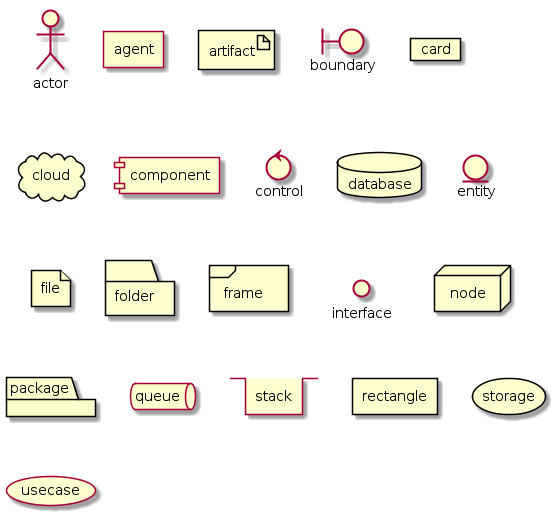
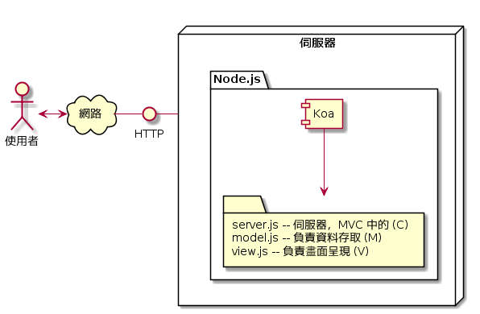
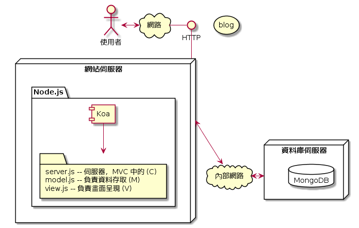

# 第 11 章 -- 上線與維護

對於《上線與維護》佈署的規劃，我們可以使用 UML 的《元件圖》 (Component Diagram) 和佈署圖 (Deployment Diagram) 表達。

## 佈署圖 (Deployment Diagram)

UML 的佈署圖符號主要有下列圖示：

```puml
@startuml
actor actor
agent agent
artifact artifact
boundary boundary
card card
cloud cloud
component component
control control
database database
entity entity
file file
folder folder
frame frame
interface  interface
node node
package package
queue queue
stack stack
rectangle rectangle
storage storage
usecase usecase
@enduml
```

## 範例 : 沒有使用資料庫

```puml 
@startuml

cloud "網路"
actor "使用者"
interface HTTP

node "伺服器" {
  package "Node.js" {
    [Koa]
    folder BlogMVC [
      server.js -- 伺服器，MVC 中的 (C)
      model.js -- 負責資料存取 (M)
      view.js -- 負責畫面呈現 (V)
    ]
    Koa --> BlogMVC
  }
}

使用者 <-> 網路
網路 - HTTP
HTTP - 伺服器

@enduml
```

## 範例 -- 使用資料庫

```puml
@startuml

cloud "網路"
cloud "內部網路"
actor "使用者"
interface HTTP
database MongoDB
storage blog

node "網站伺服器" {

  package "Node.js" {
    [Koa]
    folder BlogMVC [
      server.js -- 伺服器，MVC 中的 (C)
      model.js -- 負責資料存取 (M)
      view.js -- 負責畫面呈現 (V)
    ]
    Koa --> BlogMVC
  }
}

node "資料庫伺服器" {
  database MongoDB {
  }
}

使用者 <-> 網路
網路 - HTTP
HTTP -- 網站伺服器
網站伺服器 <--> 內部網路
內部網路 <-> 資料庫伺服器
@enduml
```

## 佈署平台

對於 node.js 的網站，您可以選擇以下類型的佈署平台：

1. 自建主機: 架設在自己機器上，可選擇採用 Linux / Windows 等系統，然後要自己申請對外 IP，這樣才能讓別人連上。
    * 如果只是要讓外網使用者連上進行測試，像是 ngrok 這樣的臨時網址是可以用的，但不太能長久營運。
2. IaaS : Linode, DigitalOcean, Vultr (虛擬私有主機), Amazon EC2, Google Cloud Platform (GCP)
3. PaaS : Azure, Amazon, Heroku, Firebase, ...

對於 Node.js 的佈署環境選擇，也有很多種不同的選擇：

1. 作業系統: Linux / Windows
2. 容器： Docker + Docker Compose 
3. 網站： Apache, Ngnix
4. Node.js 的永久執行： PM2 / Forever 
5. 網路框架: http, Koa, Express .... 

佈署是件複雜的事情，所以要盡量做到完全自動化，要達到自動佈署，您可以採用以下的一些 DevOps 方案

1. Jenkins : Continuous Integration & Deploy 方案
2. Husky : 讓 git commit 時可以掛上一些動作。

## 練習 -- blogMVC 系統佈署

1. 選定佈署平台
    * ex: Linode
2. 第一次佈署上去
    * 使用 git + pm2
3. 加上 SSL : 使用 https://www.sslforfree.com/
    * 參考: [nodejs Express + 10 分鐘申請 letsencrypt](https://medium.com/%E5%89%8D%E7%AB%AF%E5%A3%B9%E5%85%A9%E4%B8%89%E4%BA%8B/nodejs-express-10-%E5%88%86%E9%90%98%E7%94%B3%E8%AB%8B-letsencrypt-6a1fc2bce4fb)
    * 參考: [免費 SSL 申請](https://blog.johnwu.cc/article/ssl-for-free.html)
    * 參考: [SSL For Free 免費 SSL 憑證申請，使用 Let’s Encrypt 最簡單方法教學！](https://free.com.tw/ssl-for-free/)
    * 也可以使用 nginx + Let's Encrypt
4. 學習使用 DevOps 的方法
    * TravisCI -- 持續整合測試
    * husky --  讓 git commit 時可以掛上一些動作。
