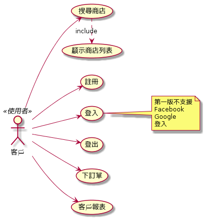
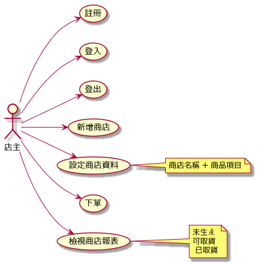
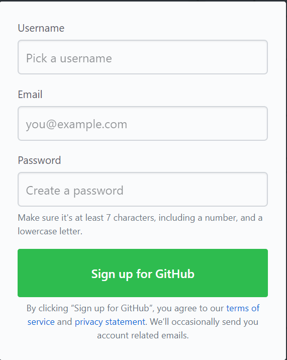
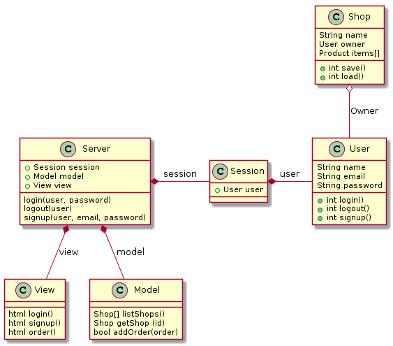
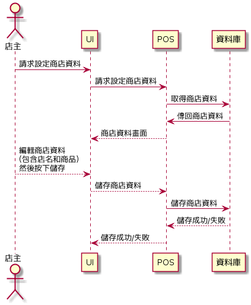
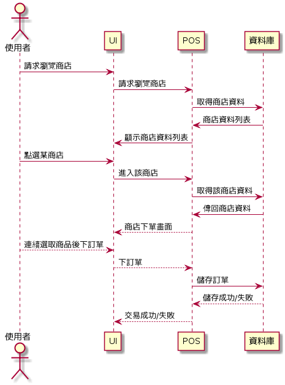
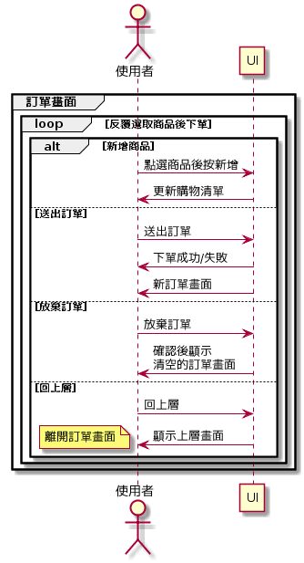
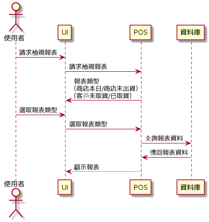

# 案例 3 -- WebPos 系統分析、設計與實作

WebPos 是一個《網路銷售時點系統》，結合了 《銷售時點系統POS》與《網路購物》兩種特色。

1. WebPos 具有《店主》與《客戶》兩種《使用者》。
    * 使用者的《身分類別》可能是《店主》或《客戶》
2. WebPos 具有《註冊/登入/登出》功能。
    * 使用者《註冊》完《帳號，密碼、身分類別》，成功後才能進行《登入》
    * 一開始先不需要支援《Facebook、Google 登入》，第二版之後才考慮
3. 《店主》登入後可以設定《商店資料》，包含《商店名稱，產品項目與價格》
4. 《客戶》不需登入就可以《搜尋商店》 (搜尋的顯示結果可呈現為 1. 商店列表 2. 商店地圖)
5. 《店主》與《客戶》都可以《下訂單》
    * 店主下訂單比較像 POS 系統的用法
    * 客戶下訂單則比較像《網路購物》的作法
6. 檢視報表
    * 店主可以檢視《商店報表》，以瞭解《當日/歷史/未取貨》等報表資訊。
    * 客戶可以檢視《客戶報表》，以瞭解自己的《已取貨/未取貨》紀錄。


## WebPos 的需求分析

上面的描述完成之後，我們就得開始想辦法《物件導向化》，而《物件導向化》的第一步，是判斷《有哪些物件？》，第二步則是判斷《物件裡會有哪些屬性或方法？》

問題是、要怎麼做呢？我們可以遵循以下三個步驟逐步進行：

1. 從描述中抽出《名詞》，這些名詞很可能會是《物件》
2. 從描述中抽出《動詞》，這些動詞很可能會是《方法》
3. 從描述中抽出《形容詞或名詞》，這些《形容詞或名詞》很可能會是《屬性或欄位》

於是我們從 WebPos 的需求描述中，抽取出下列結果。

* 名詞： WebPos / 使用者 / 店主 / 客戶 / 帳號 / 密碼 / 身分類別 / 商店資料 / 商店名稱 / 產品項目 / 產品價格 / POS 系統 / 商店報表 / 訂購報表 / 當日 / 歷史 / 未出貨 / 未取貨 / 商店列表 / 商店地圖 / 報表 / 訂單
* 動詞： 註冊 / 登入 / 登出 / 設定商店資料 / 搜尋商店 / 網路購物 / 下訂單

我們可以稍微歸類一下，看看這些名詞與動詞之間的關係，應該就可以看出下列《物件、方法與屬性》


物件      | 屬性                 | 方法 
----------|---------------------|------------------------------------------
使用者    | 帳號 / 密碼 / 身分類別:(客戶/店主)  | 註冊 / 登入 / 登出 / 下訂單 / 搜尋商店 / 設定商店資料
商店      | 名稱 / 店主             |  設定商店資料
產品      | 項目 / 價格            |
訂單      | 可取貨 / 已取貨         |  下訂單
商店報表  |                        | 檢視
客戶報表  |                        | 檢視
商店地圖  |                        | 檢視
商店列表  |                        | 檢視 / 搜尋

當我們進一步仔細想的時候，可能會發現某些遺漏，我們得想辦法補上這些遺漏的點！

例如要在地圖上顯示商店，那《商店資料》就得有《商店的位置》(例如經緯度座標、地址等等)，另外還應該有《電話、聯絡方式等等》，以方便顧客聯絡。

還有產品除了《項目 (品名) / 價格》之外，是否還有《附加選項》，例如《珍珠奶茶》要熱的還是溫的，《漢堡》需不需要《加蛋》之類的事情。

既然要搜尋商店，那應該就會有搜尋介面，搜尋條件等等。

另外《商店報表、客戶報表、商店列表》各自應該顯示那些欄位？ (商店是否要分類、要的話就應該有《商店類別》欄位，如果不分類，是否要用關鍵字搜尋，商店是否要能設定關鍵字，還是直接以產品為關鍵字 ....)

商店地圖應該顯示甚麼資訊，應該採用 Google Map 嗎等等問題？

一個店主只能經營一家商店嗎？還是可以很多家？ 這樣是否應該在《個人專區》裏顯示他經營的商店列表。

只有店主可以有《個人專區》嗎？那如果一家店有很多店員，那麼店員該如何使用系統呢？是否應該有《店員》這樣的用戶類型？還是在商店裡記錄店員名單，或者由店主指定開放存取權給店員就好了。

店主可以扮演客戶角色，去購買別家商店的產品嗎？

客戶也可以經營商店，成為店主嗎？ 這樣是否應該允許客戶創建商店。(這樣使用者還需要區分身分類別嗎？)

訂單是否還有《訂單成立》之類的屬性，是否應該用《訂單狀態》欄位來表示目前的訂單狀態才對！

於是我們增加了以下用 + 標示的欄位！

物件      | 屬性                 | 方法 
----------|---------------------|------------------------------------------
使用者    | 帳號 / 密碼 / 身分類別:(客戶/店主)  | 註冊 / 登入 / 登出 / 下訂單 / +訂購介面 / 搜尋商店 / +新增商店 / 設定商店資料
商店      | 名稱 / 店主 / +座標 / +地址 / +電話 / +備註 / +店員清單  |  設定商店資料
產品      | 項目 / 價格 / +附加項目與價錢 /  |
訂單      | +狀態 [+訂單成立 / +可取貨 / 已取貨] +訂購時間 |  下訂單
商店報表  |                        | 檢視
客戶報表  |                        | 檢視
商店地圖  |                        | 檢視
商店列表  |                        | 檢視 / 搜尋


## WebPos 的使用個案圖

使用個案 -- 客戶

```puml
@startuml
left to right direction
客戶 <<使用者>>
客戶 --> (註冊)
客戶 --> (登入)
note right of 登入 : 第一版不支援\nFacebook\nGoogle\n登入
客戶 --> (登出)
客戶 --> (搜尋商店)
(搜尋商店) .> (顯示商店列表) : include
客戶 --> (下訂單)
客戶 --> (客戶報表)
@enduml
```



使用個案 - 店主

```puml
@startuml
left to right direction
店主 --> (註冊)
店主 --> (登入)
店主 --> (登出)
店主 --> (新增商店)
店主 --> (設定商店資料)
note right of (設定商店資料) : 商店名稱 + 商品項目
店主 --> (下單)
店主 --> (檢視商店報表)
note right of (檢視商店報表) : 未生產\n可取貨\n 已取貨
@enduml
```



《使用個案圖》完成之後，就可以進一步深入更詳細的《使用個案描述》。

```
使用個案名稱：下訂單

行為者：客戶

前提：剛進入時顯示空訂單

結束狀態：選好購物項目，並送交伺服器儲存

一系列之事件：

正常程序－
1. 客戶進入某商店之訂單畫面
2. 客戶選取商品並設定數量後放入訂單
3. 訂單畫面會不斷計算金額顯示給客戶看
  3.1 計算單項產品金額＝ 單價×數量 
  3.2 計算訂購總金額：Σ（單項產品金額）
4. 客戶可以連續訂購多項商品，訂購數量最多十項。
5. 客戶完成訂單，按下《送出按鈕》下訂

例外狀況 1 －
1. 客戶不慎選錯項目，可以按下放棄處理。
2. 此種情況將不會儲存該訂單紀錄。

例外狀況 2 －
1. 客戶不慎下錯訂單。
2. 此種情況在還沒生產之前，可以取消訂單。
3. 若已經付款，則必須進行退費處理。

例外狀況 3 －
1. 客戶發現訂單內容有誤
2. 此種情況在還沒付費之前，可以修改訂單。
3. 若已經付費但未生產，則可以取消訂單，進行退費處理。
```

## 介面分析設計

根據上述的分析，我們可以設計 iPos 的重要畫面

介面設計可以採用各種工具與方法。

舉例而言，假如你曾經看過類似的介面，直接借來使用也可以，這招叫做《懶人設計法》，換句話說就是可以偷就偷。

採用這種方法，我們從 github 借用了《註冊畫面》如下：



登入畫面


而對於比較特殊，沒辦法找到類似畫面的介面，我們就得自行設計，但並不一定要一開始就設計得很好很像，只要能傳達畫面內容就大概可以了。

例如您可以使用 ppt 或 slide 這類的《簡報軟體》來設計畫面，或用《手繪素描畫面》，當然也可以用更專業的工具，像是 AxureRP 或 Visual Studio 來設計畫面。

或者直接用 HTML + CSS 設計也可以，或者採用所視既所得的網頁編輯工具也行，總之是合用就好了。

iPos 的《訂購介面》就是一個比較特殊的畫面，我找不到類似的案例，所以只好自己設計。

在此、我直接用 markdown 語法設計出畫面的樣子：


品項選單▼    附加選單▼    數量選單▼  小計_

品名 | 單價 | 附加   | 加價 | 數量 | 小計
-----|-----|-------|------|------|--------
綠茶 | 20  | 加鮮奶 | 10   |  3   | 90
珍珠奶茶 | 35  |    |      |  1   | 30

    總價: 120    【送出】  【放棄】

說明：以上畫面中，符號: ▼ 代表選單, _ 代表輸入欄位, 【...】 代表按鈕

報表的畫面也無法直接借用別的系統，不過我們可以用 markdown 很快地呈現出大概的樣子。

訂單摘要 | 價格 | 狀態 | 結帳者 | 訂購時間
--------|------|------|--------|-------
綠茶 3 .| 120  | 已取貨 | 小雅  | 3:45
紅茶 3 .| 60   | 可取貨 |       | 3:47
.....   | .... | .... |  ...   | ....


> 進階閱讀：[如何设计出易用的 UX — 对话式设计](http://blog.xdite.net/posts/2018/10/07/design-by-conversation)


在設計階段，我們必須考慮《實作的方法》，此時可能還會增加一些《物件、方法與屬性》。

由於我們要設計的是網站，因此應該會有《瀏覽器、伺服器》而且會用到《資料庫》，所以我們也新增了這些物件。

而伺服器與瀏覽器，都會有 router 之類的物件，以便處理《不同的網址與請求》！

物件      | 屬性                 | 方法 
----------|---------------------|------------------------------------------
使用者    | 帳號 / 密碼 / 身分類別  | 註冊 / 登入 / 登出 / 下訂單 / 搜尋商店 / 設定商店資料
商店      | 名稱 / 店主 / +座標 / +地址 / +電話 / +備註 / +店員清單  |  設定商店資料
產品      | 項目 / 價格 / +附加項目與價錢 /  |
訂單      | +狀態 [+訂單成立 / +可取貨 / 已取貨] +訂購時間 |  下訂單
商店報表  |                        | 檢視
客戶報表  |                        | 檢視
商店地圖  |                        | 檢視
商店列表  |                        | 檢視 / 搜尋


## 類別圖

```puml
@startuml

class User {
  String name
  String email
  String password

  +int login()
  +int logout()
  +int signup()
}

class Shop {
  String name
  User owner
  Product items[]

  +int save()
  +int load()
}

class Server {
  +Session session
  +Model model
  +View view

  {method} login(user, password)
  {method} logout(user)
  {method} signup(user, email, password)
}

class Session {
  +User user
}

class View {
  html login()
  html signup()
  html order()
}

class Model {
  Shop[] listShops()
  Shop getShop (id)
  bool addOrder(order)

}

Server *- Session : session
Session *- User : user
Shop o-- User : Owner
Server *-- View : view
Server *-- Model : model
@enduml
```



## 循序圖

個案：註冊/登入/登出 

使用者: 店主 + 客戶

```puml
@startuml
actor 使用者
使用者 -> UI: 請求註冊
UI -> POS: 請求註冊
POS --> UI: 註冊畫面
使用者 -> UI: 輸入《帳號》
UI -> POS: 檢查帳號
POS -> 資料庫: 檢查該帳號是否存在
資料庫 -> POS: 該帳號存在(是/否)
POS --> UI: 若該帳號已存在，提示修改訊息
使用者 -> UI: 輸入《密碼、基本資料》
UI -> POS: 註冊《帳號、密碼、基本資料》
POS -> 資料庫: 儲存該《帳號、密碼、基本資料》
資料庫 -> POS: 儲存成功/失敗
POS --> UI: 註冊成功(發認證信)\n註冊失敗(提示)
...
使用者 -> UI: 請求登入
UI -> POS: 請求登入
POS --> UI: 登入畫面
使用者 -> UI: 輸入帳號密碼
UI -> POS: 登入《帳號、密碼》
POS -> 資料庫: 查詢《帳號、密碼》
資料庫 --> POS : 傳回《帳號、密碼》
POS --> UI: 登入《成功/失敗》
...
使用者 -> UI: 請求登出
UI -> POS: 登出《使用者》
POS --> UI: 登出《成功/失敗》
@enduml
```


個案：設定商店資料

使用者 : 店主

```puml
@startuml
actor 店主
店主 -> UI: 請求設定商店資料
UI -> POS: 請求設定商店資料
POS -> 資料庫: 取得商店資料
資料庫 -> POS : 傳回商店資料
POS --> UI: 商店資料畫面
店主 --> UI: 編輯商店資料\n(包含店名和商品)\n然後按下儲存
UI --> POS: 儲存商店資料
POS -> 資料庫: 儲存商店資料
資料庫 --> POS : 儲存成功/失敗
POS -->  UI: 儲存成功/失敗
@enduml
```



個案：搜尋商店/下單

使用者 : 店主 + 客戶

```puml
@startuml
actor 使用者
使用者 -> UI: 請求瀏覽商店
UI -> POS : 請求瀏覽商店
POS -> 資料庫 : 取得商店資料
資料庫 -> POS : 商店資料列表
POS -> UI : 顯示商店資料列表
使用者 -> UI: 點選某商店
UI -> POS: 進入該商店
POS -> 資料庫: 取得該商店資料
資料庫 -> POS : 傳回商店資料
POS --> UI: 商店下單畫面
使用者 --> UI: 連續選取商品後下訂單
UI --> POS: 下訂單
POS -> 資料庫: 儲存訂單
資料庫 --> POS : 儲存成功/失敗
POS --> UI: 交易成功/失敗
@enduml
```



個案：連續選取商品後下訂單

使用者 : 店主 + 客戶

```puml
@startuml
actor 使用者
group 訂單畫面
  loop 反覆選取商品後下單
    alt 新增商品
      使用者 -> UI: 點選商品後按新增
      UI -> 使用者: 更新購物清單
    else 送出訂單
      使用者 -> UI: 送出訂單
      UI -> 使用者: 下單成功/失敗
      UI -> 使用者: 新訂單畫面
    else 放棄訂單
      使用者 -> UI: 放棄訂單
      UI -> 使用者: 確認後顯示\n清空的訂單畫面
    else 回上層
      使用者 -> UI: 回上層
      UI -> 使用者: 顯示上層畫面
      note left: 離開訂單畫面
    end
  end
end

@enduml
```



個案：商店報表

使用者 : 店主 + 客戶

```puml
@startuml
actor 使用者
使用者 -> UI: 請求檢視報表
UI -> POS: 請求檢視報表
POS -> UI: 報表類型\n(商店本日/商店未出貨)\n(客戶未取貨/已取貨)
使用者 -> UI: 選取報表類型
UI -> POS: 選取報表類型
POS -> 資料庫: 查詢報表資料
資料庫 -> POS : 傳回報表資料
POS --> UI: 顯示報表
@enduml
```



## 演算法

請列出較複雜的關鍵演算法，並用 PDL 寫出這些算法。 

(PDL : Program Description Language)

PDL 基本上就是寫出來的演算法 ...
