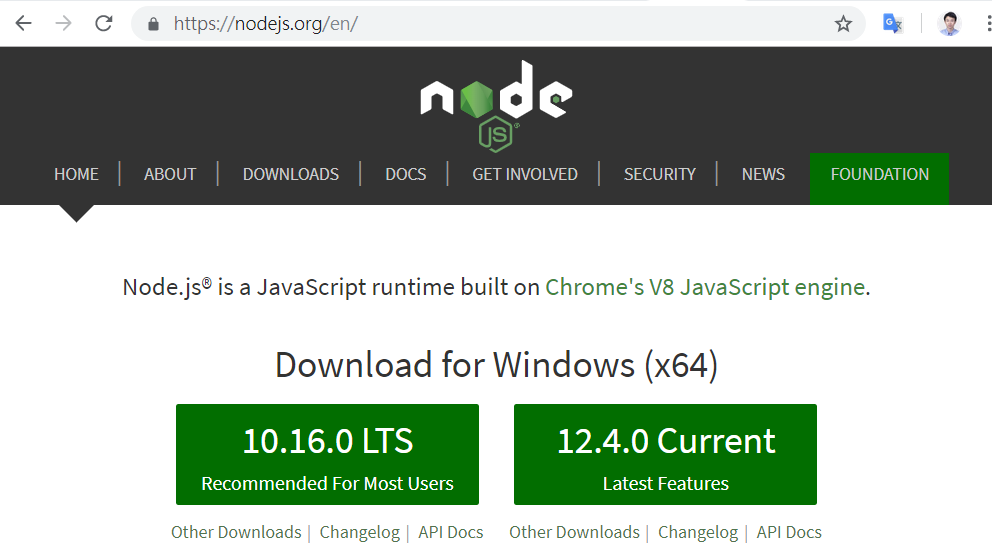

## Node.js 開發環境

Node.js 是 Ryan Dahl 基於 Google 的 V8 引擎於 2009 年釋出的一個 JavaScript 開發平台，主要聚焦於 Web 程式的開發，通常用被來寫網站。

但是、要開發網站就勢必要把「 HTML, CSS, Web」等等技術扯進來，這對那些單純想用 JavaScript 做為第一門語言的學習者而言，勢必是非常困擾的。有鑑於此，我們將撰寫一系列用 Node.js 學基礎 JavaScript 語法的文章，以便讓初學者也能透過 Node.js 這個環境學會 JavaScript 語言。

### node.js 的安裝

您可以 node.js 的官方網站中下載並安裝此一開發環境，網址如下：

* <http://nodejs.org/>




在筆者撰寫本書時， node.js 穩定版為 v4.4.4，而目前開發版本為 v6.1.0，筆者通常會選擇安裝《穩定版》(除非有最新功能的特殊需求，筆者才會選擇目前開發版)。

您可以下載後一直按下一步就可以安裝完成了。(筆者所使用的環境是 Windows 8，所以下載時會得到 windows 版的安裝檔，例如 node-v4.4.4-x64.msi 這樣的檔案)。

筆者在 Windows 中安裝完成之後，可以在應用程式區域找到 node.js 的相關程式。

點選了 `node.js command prompt` 可以啟動了一個命令列環境，然後用編輯器 (我是用 Visual Studio Code) 寫了一個 hello.js 的程式如下。

檔案： hello.js

```javascript
console.log("hello!");
```

我們將 hello.js 檔案放在 `D:\jsbook\` 這個資料夾裏面，然後在 `node.js command prompt` 裡面用下列操作，

```
Your environment has been set up for using Node.js 5.1.0 (x64) and npm.

C:\Users\user>d:

D:\>cd jsbook

D:\jsbook>dir
 磁碟區 D 中的磁碟是 Data
 磁碟區序號:  9EBE-C367

 D:\jsbook 的目錄

2016/07/02  上午 09:13    <DIR>          .
2016/07/02  上午 09:13    <DIR>          ..
2016/07/02  上午 09:13                22 hello.js
               1 個檔案              22 位元組
               2 個目錄  104,252,784,640 位元組可用

D:\jsbook>node hello.js
hello!
```

您會看到當我們用 `node hello.js` 這個指令執行該程式時，畫面中會出現該程式的執行結果，印出 `hello!` 訊息！
