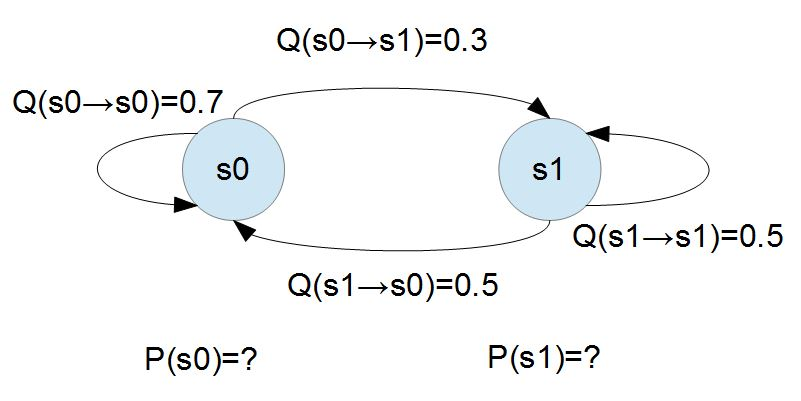
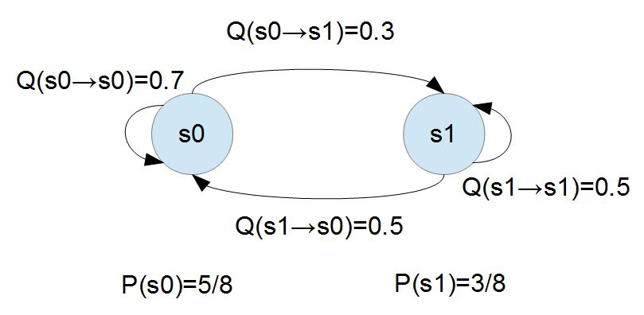

## 蒙地卡羅法 Monte-Carlo

### 蒙地卡羅演算法 (Monte Carlo Algorithm)

利用亂數隨機抽樣的方式以計算某種解答的演算法，被稱為蒙地卡羅演算法，其中最簡單的方法是直接取樣算法。


### 用蒙地卡羅法算 Pi

舉例而言，假如我們不知道半徑為 1 的圓形面積，那麼就可以利用亂數隨機取樣 1百萬個介於 0 到 1 之間的 (x,y) 值，然後看看有多少點落在圓內 (x^2 + y^2 <=1) 來計算 P。最後利用 4 * P(在圓之內) 就可以計算出該圓形的面積。


> 上圖來自維基百科 https://upload.wikimedia.org/wikipedia/commons/thumb/8/84/Pi_30K.gif/330px-Pi_30K.gif

以下是用用蒙地卡羅法計算 Pi 的程式碼。

* 程式範例： https://github.com/cccbook/algjs/blob/master/code/07-monteCarlo/pi/monteCarloPi.js


```js
function monteCarloPi(n) {
  let hits = 0
  for (let i=0;i<n; i++) {
    let x = Math.random()
    let y = Math.random()
    if (x*x+y*y <= 1) hits++
  }
  return 4*(hits/n)
}

console.log('MonteCarloPi(100000)=', monteCarloPi(100000))
```

執行結果

```
$ node monteCarloPi.js
MonteCarloPi(100000)= 3.14056
$ node monteCarloPi.js
MonteCarloPi(100000)= 3.14228
$ node monteCarloPi.js
MonteCarloPi(100000)= 3.14628
```

### 馬可夫鏈

「馬可夫鏈」是一種具有狀態的隨機過程，有點像是「有限狀態機」，但是「從目前狀態轉移 s 到下一個狀態 s' 的機率」由 Q(s=>s') 所表示，這個狀態之轉移機率並不會受到狀態以外的因素所影響，因此與時間無關。

隨機漫步就是馬可夫鏈的例子。隨機漫步中每一步的狀態是在圖形中的點，每一步可以移動到任何一個相鄰的點，在這裡移動到每一個點的概率都是相同的(無論之前漫步路徑是如何的)。

假如我們不斷的觀察某種隨機現象，會看到許多一連串的觀察值 x1, x2,..., xn ，這些觀察值會形成整個隨機現象空間 X1, X2,..., Xn。

假如這些觀察值之間有某種因果關係，那麼我們就有可能透過馬可夫過程描述此因果關係，舉例而言，如果每個事件只受到前一個事件的影響，那麼就可以用 P(X[n+1] | X[n]) 表示此隨機現象，這種隨機過程稱為時間無關的馬可夫鏈 (Time-homogeneous Markov chains,  或稱為穩定型馬可夫鏈 stationary Markov chains)。

假如下一個觀察值可能受前 m 個觀察值所影響，那麼此種隨機過程可由機率分布 P(X[n+1] | X[n], ..., X[n-m+1') 表示，因此稱為 m 階的馬可夫過程。

以下我們只討論一階馬可夫鏈，也就是每個事件只受到前一個事件的影響的情況，這可以用 P(X[n+1] | X[n]) = Q(s=>s') 描述。

### 計算馬可夫鏈機率

對於一個具有「馬可夫特性」的「機率式有限狀態機」，我們可以用「機率轉移矩陣」進行描述，舉例而言：下圖顯示了一個只有兩個狀態的「馬可夫隨機系統」。


若要用機率模型描述上述兩個狀態的馬可夫系統，我們需要給定兩組機率值，第一組是狀態本身的機率 P(s0)、P(s1)。第二組是狀態轉移的機率 Q(s0=>s0)、Q(s0=>s1)、Q(s1=>s0)、Q(s1=>s1) 。

以下是上圖的機率分佈描述程式 prob.js ： (我們把 P, Q 全部整合在單一的 P 陣列中）

```js
// 狀態機率： P(a) = 0.2, P(b) = 0.8
// 轉移機率： P(x => y)
//    a   b
// a  0.7 0.3
// b  0.5 0.5
const P = {
  'a': 0.2, 'b': 0.8,
  'a=>a': 0.7, 'a=>b':0.3,
  'b=>a': 0.5, 'b=>b':0.5,
}

module.exports = P

```

有了這上述機率分佈 P, 我們就可以輕鬆地計算任意序列的出現機率了。

假如

```js
// 參考： 自然語言處理 -- Hidden Markov Model http://cpmarkchang.logdown.com/posts/192352
const P = require('./prob')
function markov(s) {
  let p = P[s[0]]
  for (let i=1; i<s.length; i++) {
    let key = s[i-1]+'=>'+s[i]
    p = p * P[key]
  }
  return p
}

const seq = ['b', 'a', 'b', 'b']

console.log('P(%j)=%d', seq, markov(seq))
```

執行結果：

```
$ node markov.js
P(["b","a","b","b"])=0.06
```

上述馬可夫鏈的機率，是用確定性的計算方法算出的，並不算是『蒙地卡羅法』，因為所謂的蒙地卡羅法是用『亂數』模擬後進行統計的方法，上述方法沒有『亂數模擬』。

### 蒙地卡羅馬可夫算法 (Monte Carlo Markov Chain, MCMC)

接著我們用『亂數模擬』的方法來模擬上述『馬可夫鏈』問題，程式碼如下：

```js
const P = require('./prob')

const rnd = Math.random
function mcmc(s) { // Monte Carlo Markov Chain
  if (rnd() > P[s[0]]) return 0
  for (let i=1; i<s.length; i++) {
    let key = s[i-1]+'=>'+s[i]
    if (rnd() > P[key]) return 0
  }
  return 1
}

function markov(s, n) {
  let pass = 0
  for (let i=0; i<n; i++) {
    pass += mcmc(s)
  }
  return pass/n;
}

const seq = ['b', 'a', 'b', 'b']

console.log('P(%j)=%d', seq, markov(seq, 100000))

```

執行結果

```
$ node mcmc
P(["b","a","b","b"])=0.06019
$ node mcmc
P(["b","a","b","b"])=0.06103
$ node mcmc
P(["b","a","b","b"])=0.05955
```

### 結語

當問題很單純，而且我們知道簡單明確的算式時，不需要使用『蒙地卡羅法』，但是若問題很複雜，沒有明確簡單的算式時，用蒙地卡羅法就是個好的選擇！

透過隨機模擬的方式，可以用統計法計算出很多分布的機率，這就是蒙地卡羅法！

### 習題

1. 請設計出一個蒙地卡羅 gibbs 算法，算出『馬可夫粗略平衡』(「一般平衡狀態」) 時各個狀態的機率！
    * 『馬可夫粗略平衡』請參考下列描述！

### 習題 1 的背景知識 -- 馬可夫平衡

長期來看、馬可夫系統通常最後會達到一個穩定平衡，在平衡的情況之下，每個節點的輸出將會等於該節點的輸入，這就是所謂的「一般平衡條件」。

讓我們用下圖的範例來說明「馬可夫系統」達到穩定平衡時的狀況。



對於上述有「馬可夫隨機系統」，我們可以用「二元一次聯立方程式」求解 P(s0) 與 P(s1)，假如我們將 P(s0) 寫為 P0，P(s1) 寫為 P1，那麼整個系統達到平衡時，應該會有下列狀況。

```
P0*0.3 = P1*0.5 ; P0 的流出量 = P0 的流入量
P0+P1 = 1       ; 狀態不是 s0 就是 s1
```

如果我們求解上述方程式，就可以得到 (P0=5/8, P1=3/8)，此時整個系統會達到平衡。

假如我們模擬機率性粒子在馬可夫鏈中的移動行為，最後這些移動將達到一個平衡。在達到平衡後，從 x 狀態流出去的粒子數，將會等於流回該狀態的粒子數，也就是必須滿足下列『平衡條件』的要求。

$$\sum_y P(x) Q(x \to y)  = \sum_y P(y) Q(y \to x)$$

當隨機的粒子移動時，如果從 x 流出的粒子較多，自然會讓 P(x) 下降，最後仍然達到平衡，如果流入 x 的粒子比流出的多，那麼 P(x) 自然就會上升，只要我們能模擬流出流入的程序，最後整個馬可夫系統將會達到平衡。



上圖顯示了上述馬可夫系統處於「一般平衡狀態」時的狀況，您可以發現其中的「節點 s0 的總流出」為 $$(5/8*0.3 = 15/80)$$ ，而「節點 s0 的總流入」$$(3/8*0.5 = 15/80)$$，其計算過程如下所示。

$`\sum_y P(x) Q(x \to y) = 5/8 * 0.3 = 15/80 = 3/8*0.5 = \sum_y P(y) Q(y \to x)`$

運用上述的「一般平衡條件」，當我們已經知道「轉移矩陣」$$Q(x \to y)$$ 的每個數值，但是卻不知道達成平衡的節點機率 P(x) 時，可以設計出一種稱為 「Gibbs 演算法」的學習程式，該算法可以尋找出每個節點達到平衡時的機率值。

### 用迭代法求解馬可夫鏈的平衡機率 -- Gibbs Algorithm


```
// Gibbs Algorithm 的範例
// 問題：機率式有限狀態機，P(a=>b)=0.3, P(b=>a)=0.5 ; P(a=>b)=0.7, P(b=>b)=0.5
// 目標：尋找該「機率式有限狀態機」的穩態，也就是 P(a) = ?, P(b)=? 時系統會達到平衡。
const P = require('./prob')
function gibbs (P) {
  var P0 = {'a': P['a'], 'b': P['b'] }
  do {
    var P1 = { // 下一輪的機率分布。
      'a': P0['a'] * P['a=>a'] + P0['b'] * P['b=>a'], 
      'b': P0['a'] * P['a=>b'] + P0['b'] * P['b=>b']
    }
    console.log('P1 = %j', P1)
    var da = P1['a'] - P0['a'], db = P1['b'] - P0['b'] // 兩輪間的差異。
    var step = Math.sqrt(da * da + db * db) // 差異的大小
    P0 = P1
  } while (step > 0.001)  // 假如差異夠小的時候，就可以停止了。
  console.log('標準答案:P(a)=5/8=%d P(b)=3/8=%d', 5 / 8, 3 / 8) // 印出標準答案，以便看看我們找到的答案是否夠接近。
}

gibbs(P)

```

執行結果

```
$ node gibbs
P1 = {"a":0.54,"b":0.46}
P1 = {"a":0.608,"b":0.392}
P1 = {"a":0.6215999999999999,"b":0.37839999999999996}
P1 = {"a":0.62432,"b":0.37567999999999996}
P1 = {"a":0.624864,"b":0.37513599999999997}
標準答案:P(a)=5/8=0.625 P(b)=3/8=0.375
```

### 習題 1 解答

```js
const P = require('./prob')

const rnd = Math.random
function mcmc() { // Monte Carlo Markov Chain
  let s1 = (rnd() < P['a']) ? 'a' : 'b'
  let s2 = (rnd() < P[s1+'=>'+'a']) ? 'a' : 'b'
  if (s1 == s2) return
  P[s1] -= 0.0001
  P[s2] += 0.0001
}

function gibbs(n) {
  for (let i=0; i<n; i++) {
    mcmc()
  }
}

console.log("P=%j", P)
gibbs(1000000)
console.log('P=%j', P)
```

執行結果

```
$ node mcmcGibbs
P={"a":0.2,"b":0.8,"a=>a":0.7,"a=>b":0.3,"b=>a":0.5,"b=>b":0.5}
P={"a":0.6301999999999527,"b":0.3698000000000474,"a=>a":0.7,"a=>b":0.3,"b=>a":0.5,"b=>b":0.5}
$ node mcmcGibbs
P={"a":0.2,"b":0.8,"a=>a":0.7,"a=>b":0.3,"b=>a":0.5,"b=>b":0.5}
P={"a":0.6163999999999542,"b":0.3836000000000459,"a=>a":0.7,"a=>b":0.3,"b=>a":0.5,"b=>b":0.5}
$ node mcmcGibbs
P={"a":0.2,"b":0.8,"a=>a":0.7,"a=>b":0.3,"b=>a":0.5,"b=>b":0.5}
P={"a":0.6220999999999536,"b":0.37790000000004653,"a=>a":0.7,"a=>b":0.3,"b=>a":0.5,"b=>b":0.5}
$ node mcmcGibbs
P={"a":0.2,"b":0.8,"a=>a":0.7,"a=>b":0.3,"b=>a":0.5,"b=>b":0.5}
P={"a":0.618499999999954,"b":0.38150000000004614,"a=>a":0.7,"a=>b":0.3,"b=>a":0.5,"b=>b":0.5}
```

<!--

## 貝氏網路 (Bayesian Network)

貝氏網路是用來描述機率因果關係的網路，對於一個已知的貝氏網路 (Bayesian Network)，其中的某個樣本 $$(x_1, ..., x_n)$$  的機率可以用下列算式表示

$$P(x_1, ..., x_n) = \prod_{i=1}^{n} P(x_i | parent(X_i))$$

貝氏網路也可以被視為某種隱馬可夫模型，其中某些節點是可觀察節點 (X)，某些節點是隱含節點 (Z) ，我們可以透過蒙地卡羅馬可夫算法計算某個分布 $$P(x_1, ..., x_n)$$ 的機率值。

## 參考文獻

* [A Brief Introduction to Graphical Models and Bayesian Networks](http://www.cs.ubc.ca/~murphyk/Bayes/bnintro.html)
* [A brief introduction to Bayes' Rule](http://www.cs.ubc.ca/~murphyk/Bayes/bayesrule.html)
* <http://www.cs.ubc.ca/~murphyk/Software/BNT/Talks/BNT_mathworks.ppt>


## 簡介

在機率理論中，所謂的機率模型，通常是指某種機率獨立性的假設。舉例而言，在簡單貝氏模型 (Naive Bayes Model) 當中，就假設所有的隨機變數 X1, X2,..., Xn 相對於某個前提 C 而言都是條件獨立的，因此可以寫成如下算式。 

$$P(x_1 ... x_n| c) = P(x_1|c) \cdots P(x_n | c)$$

這種機率獨立性的假設，就是一種統計上的假說，我們必須驗證這樣的假說是否合理，如果驗證合理才能使用該公式，否則將會造成龐大的誤差。

## 計算統計學中的假說

有時候，我們會將假說的概念 h 放入機率分布函數中，當成機率分布的參數之一，例如 P(x, h) 其實代表了由 h 假說所決定的一個機率特定機率分布 p，作用在樣本 x 上的結果 。

在具有假說 h 的情況之下，P(h) 代表由假說 h 所決定的一個機率分布，這是一個特定的機率分布，按照上述規則，原本應該用某個小寫的 p 所代表，但是由於引入了函數形式的關係，我們用 P(h) 代表該假說所決定的特定機率分布。

大寫的 P 符號通常則代表假說 $P(h_1), P(h_2), ... P(h_n)$ 所形成的機率分布集合，計算統計學的主要任務是找出最好的假說，以便用該假說的機率分布進行預測。這個尋找最佳假說的過程可用下列公式表達。

$$\arg\max_h P(h|x,y) = \arg\max_h P(x,y|h) \frac{P(h)}{P(x,y)}$$

計算統計學通常會用程式 (演算法) 尋找最符合訓練資料 $(x_1,y_1) (x_2,y_2) ...., (x_n,y_n)$ 的假說 P(h)，這個過程稱為學習。當電腦完成學習的程序之後，就可以利用 P(h) 預測整個系統的下一個輸出之機率。

通常在預測進行時系統會取得某些輸入值 x，然後再利用該輸入值找到一個最可能的輸出值，也就是找到讓 P(y|x,h) 最大的輸出 y，因此整個預測程序仍然是一個最佳化的過程，如下列公式所示。

$$\arg\max_y P(y|x,h)$$

## 計算統計學中的學習

要找出計算統計學中的最佳假說，通常採用最大似然法則作為最佳化的目標算式，但實際上最大似然法則與最大商法則乃是一體的兩面，因此也常採用最大商法則進行學習。

### 『最大熵法則』 與 『最大似然法則』

$$
\begin{aligned}\sum_z P(Z=z|x,h) L(x,Z=z|h) &= \sum_z \frac{P(x,Z=z,h)}{P(x,h)} \log P(x,Z=z|h) \\&= \frac{1}{P(x,h)} \sum_z P(x,Z=z,h) \log P(x,Z=z|h) \\&= \frac{1}{P(x,h)}H(x,Z|h)\end{aligned}
$$

-->


