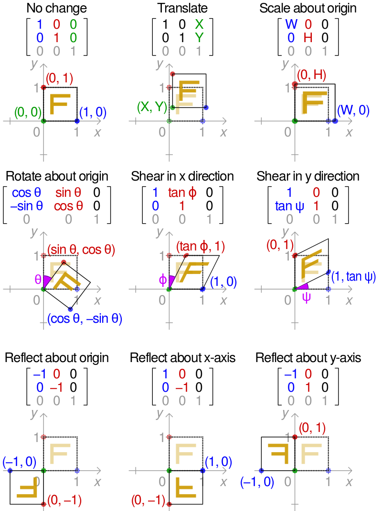

## 幾何學

### 幾何學在電腦裡的用途

幾何圖形的用途 ，從《計算機圖學》到《人工智慧》領域無所不在

舉例而言 ，人工智慧裡的爬山演算法 ，主要是在尋找《函數最高點》 https://mdbookspace.com/view/ai/chapter2.md

方法非常簡單，就是一直往更高的方向爬 https://mdbookspace.com/view/ai/hillClimbingMax.md

而神經網路裡的梯度下降法 ，和爬山演算法做的 事情幾乎一樣 ，只是方向永遠是 梯度方向而已

這些方法 ，不管是在 1 維、 2 維、 3 維、 4 維 還是更高維空間，都是管用的

但是 ，通常只能找到《區域最高點或最 低點》，無法保證找到全域最高 點或最低點。

在上面的例子中 ，圖形最後都對應到了《函數》 ，而函數畫出來的圖形，讓我們對 結果有了視覺化的感受 ...

而且不只如此 ，函數還可以用來轉換圖形

像是計算機圖學裏的 ，《縮放、旋轉》等變換都可以用矩陣函數表示

如果把矩陣加大一維 ，那麼就可以納入《平移》變換

平移、縮放、旋轉三種運算 ，形成的變換屬於仿射變換 (affine transformation) ，因此是仿射幾何學的特例 ...

仿射變換 ，是碎形幾何的基礎

如果把旋轉運算放到三維空間 ，就可以得到針對不同軸心的三種旋轉運算 對 x 軸旋轉 對 y 軸旋轉 對 z 軸旋轉

於是圖形的呈現問題 ，就成了《矩陣運算》的問題

但是 ，由於我們的顯示器通常是二維的 ，要把三維物體顯示在二維平面中 那該怎麼辦呢？

透視投影可以解決這個問題

西洋文藝復興時期 單點透視法也成了繪畫的一大特色 中國的繪畫就沒有經過這樣的時期 ( 水墨畫完全不管比例問題 )

所以 ，笛卡兒的《解析幾何》對程式人 而言，可以說是一種《常識》

因為寫程式常常用到 ，但程式人卻不太知道自己正在 使用《幾何學知識》 ...

以座標代表《點》 ，然後以《函數或方程式》代表《線》的 方式，早已深深地烙印在程式人的腦海 裡，不需要特別強調背後的數學了 ...

### 空間

在數學上、所謂的空間，是一個加上了某些《數學結構》的集合。

### 正定 (Positive Definite)

在數學上

#### 正定函數

正定函數的定義如下：

1. d(x, y) ≥ 0 (非負性，或稱分離公理)
2. d(x, y) = 0 若且唯若 x = y (同時公理)

### 正定矩陣

一個 n×n 的實對稱矩陣 M是正定的，若且唯若對於所有的非零實係數向量 z，都有 $`z^T M z>0`$ 。

### 範數
向量空間中的《範數》(Norm)，是一個具有下列特性的函數。

1. $`p(v) \ge 0`$（半正定性）
2. $`p(a v) = |a| p(v)`$（絶對一次齊次性）
3. $`p(u + v) \le p(u) + p(v)`$ （[[三角不等式]]）
4. $`p(v)=0`$ ,若且唯若 v 是《零向量》（[[正定性]]）

假如拿掉第 4 條，那麼該範數稱為《半範數》(Seminorm)。

### 度量空間

最常見的一種空間是《度量空間》 (Metric Space) ，《度量空間》是《集合》加上了《距離函數》的結果。

集合 X 上的度量 (Metric) 為一函數 (稱之為「距離函數」或簡稱為「距離」)

> d : X × X → R

這裡的 R 是實數的集合，且對於所有 X 內的 x、y、z，均滿足如下條件:

1. d(x,y) 為正定函數。
2. d(x, y) = d(y, x) (對稱性)
3. d(x, z) ≤ d(x, y) + d(y, z) (次加性 / 三角不等式)。

條件 1 與條件 2 為《正定函數》的定義。
 

最常見的度量空間是《歐氏空間》，其《距離度量》如下：

$`d(x,y):=\sqrt{(x_1-y_1)^2 +(x_2-y_2)^2 + \cdots +(x_n-y_n)^2} = \sqrt{\sum_{i=1}^n(x_i-y_i)^2}`$

在《向量空間》中，上述的《歐幾里得距離度量》，稱為《歐幾里得範數》。

### 點變換與矩陣

矩陣轉換是計算機圖學的核心觀念，當您用 3D 建模軟體時，會不斷使用《平移、縮放、旋轉》等動作，而這些動作都牽涉到大量的《矩陣運算》，所以《繪圖卡和GPU》裏都會透過加入很多 ALU 進行平行運算，以便加速這些矩陣的運算過程。

### 二維的轉換矩陣之效果

* [維基百科:變換矩陣](https://zh.wikipedia.org/wiki/%E5%8F%98%E6%8D%A2%E7%9F%A9%E9%98%B5)
* [Wikipedia:Transformation Matrix](https://en.wikipedia.org/wiki/Transformation_matrix)

### 三維的轉換矩陣之效果

* [維基百科:旋轉矩陣](https://zh.wikipedia.org/wiki/%E6%97%8B%E8%BD%AC%E7%9F%A9%E9%98%B5)

### 參考文獻

* [維基百科:空間對稱群](https://zh.wikipedia.org/wiki/%E7%A9%BA%E9%96%93%E5%B0%8D%E7%A8%B1%E7%BE%A4)
* [維基百科:正交群](https://zh.wikipedia.org/wiki/%E6%AD%A3%E4%BA%A4%E7%BE%A4)
* [旋轉群SO(3)](https://zh.wikipedia.org/wiki/%E6%97%8B%E8%BD%89%E7%BE%A4)

