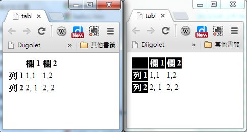
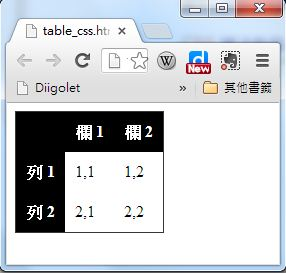
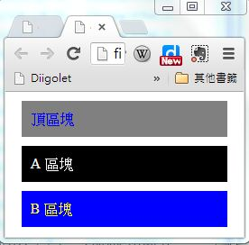

## CSS 網頁排版語言

### CSS 簡介

我們可以透過 HTML 的表格排出某些格式，但是卻很難讓整個頁面足夠美觀。

舉例而言，假如我們想讓表格的標頭欄以黑底白字的方式顯示，那麼就得靠 CSS 來幫忙了。

CSS 是 Cascading Style Sheets 的簡稱，中文可翻譯為「串接樣式表」，CSS 主要是用來設定 HTML 的顯示版面，包含「字體、大小、顏色、邊框、背景」等等，一個好的 CSS 可以讓您的網頁變得很美觀，而且不需要大幅修改網頁的內容，只要加入一個 CSS 引用即可。

當套用不同的 CSS 時，網頁的風格就可以產生完全不同的感覺，這讓你的網頁可以輕易的更換成不同的版型。事實上、當您在 blogspot 或 wordpress 網誌平台套用不同版型的時候，只不過是更換了 CSS 樣版而已。

在 HTML 當中，CSS 有兩種寫法，一種是內嵌式的寫法，另一種是外連式的寫法。

為了說明 CSS 的語法，先讓我們回顧一下，一個簡單沒有格式化的 HTML 表格，其寫法如下：

```html
<html>
<head><meta charset='utf-8'></head>
<body>
<table>
<tr><th></th><th>欄 1</th><th>欄 2</th></tr>
<tr><th>列 1</th><td>1,1</td><td>1,2</td></tr>
<tr><th>列 2</th><td>2,1</td><td>2,2</td></tr>
</table>
</body>
</html>
```

檢視檔案： [table.htm](table.htm)

如果我們將上述表格的 th 部分，都加上 `style="background-color:black; color:white;"` 這樣的 CSS 語法，那麼我們就會得到一個黑底白字的表格。

```html
<html>
<head><meta charset='utf-8'></head>
<body>
<table>
<tr>
<th style="background-color:black; color:white;"></th>
<th style="background-color:black; color:white;">欄 1</th>
<th style="background-color:black; color:white;">欄 2</th>
</tr>
<tr>
<th style="background-color:black; color:white;">列 1</th>
<td>1,1</td>
<td>1,2</td>
</tr>
<tr>
<th style="background-color:black; color:white;">列 2</th>
<td>2, 1</td>
<td>2, 2</td>
</tr>
</table>
</body>
</html>
```

檢視檔案： [tablecss_embed.htm](tablecss_embed.htm)

我們使用 CSS 排版前與排版後的結果可以對照如下：



您可以看到在這種寫法當中，我們幾乎都一直在 th 重複撰寫 `style="background-color:black; color:white;"` 這一行文字，總共重複了 5 次，這顯然是很浪費時間的行為。

如果我們可以改用統一的方式，寫出「對於所有 th 而言，我都要用 background-color:black; color:white; 這樣的方式顯示」那不就簡單多了嗎？

是的、CSS 確實可以讓您這樣做，讓我們將上述範例修改成統一設定格式的版本，如下所示。

```html
<html>
<head>
<meta charset='utf-8'>
<style>
th { background-color:black; color:white; }
</style>
</head>
<body>
<table>
<tr><th></th><th>欄 1</th><th>欄 2</th></tr>
<tr><th>列 1</th><td>1,1</td><td>1,2</td></tr>
<tr><th>列 2</th><td>2,1</td><td>2,2</td></tr>
</table>
</body>
</html>
```

上述統一將 CSS 寫在 `<head><style>...</style></head>` 裏的這種寫法，比起內嵌式的顯然簡短多了，這種寫法正是 CSS 的精華之所在。

但是、如果我們想要對整個網站的所有檔案，都套用同一種格式的話，那麼在每個 HTML 的頭部都要嵌入一整套 CSS 語法，那就不太方便了，萬一我們想要改變版面格式，不就每個 HTML 檔案都要更改，這顯然還不夠好用。

要解決這個問題，可以將表頭的 CSS 獨立到一個檔案中，然後再用連結的方式引用，這樣只要修改那個 CSS 檔案，整個網站的風格就跟著改變，所以上述檔案就可以改寫如下。

檔案： [table_css.htm](table_css.htm)

```html
<!DOCTYPE html>
<html>
<head>
<meta charset='utf-8'>
<link rel="stylesheet" type="text/css" href="mystyle.css">
</head>
<body>
<table>
<tr><th></th><th>欄 1</th><th>欄 2</th></tr>
<tr><th>列 1</th><td>1,1</td><td>1,2</td></tr>
<tr><th>列 2</th><td>2,1</td><td>2,2</td></tr>
</table>
</body>
</html>
```

檔案： [mystyle.css](mystyle.css)

```css
th { background-color:black; color:white; }
```

透過這種方式，我們就可以為網頁設計統一的風格，也比較容易更換網頁的排版風格了，這就是 CSS 語法的用途了。

當然、上述的網頁還不夠好看，如果我們將 mystyle.css 修改如下，您就會發現表格變得好看多了。

```css
table { border-collapse: collapse; border: 1px solid #373737; }
th { background-color:black; color:white; padding:10px; margin:10px; }
td { padding:10px; margin:10px; }
```




### 路徑, tag, id 與 class

即使有了可以統一套用的方式，有時我們還是會感覺到不方便，舉例而言，如果我們想要對某個表格套上 A 格式，然後在對另一個表格套上 B 格式，這時採用上述方法就不太夠用了。

為了解決這種問題，HTML 發展出了 id 與 class 這兩個屬性，我們可以根據 id 或 class 的名稱分別套用不同的 CSS 樣式。

舉例而言，以下網頁中有兩個 div 框，我們可以分別為這兩個框套用不同的格式，其中 classA 前面加了點符號，成為「.classA」，代表要比對的是 class 屬性，如果想要比對的是 id 屬性，那麼就可以加上井字符號 # (像是範例中 #topbar 的情況)。

```html
<html>
<head>
<meta charset='utf-8'>
<style>
#topbar { background-color:gray; color:blue; padding:10px; margin:10px; }
.classA { background-color:black; color:white; padding:10px; margin:10px; }
.classB { background-color:blue; color:yellow; padding:10px; margin:10px; }
</style>
</head>
<body>

<div id="topbar">頂區塊</div>

<div class="classA">A 區塊</div>

<div class="classB">B 區塊</div>

</body>
</html>
```

檢視檔案： [div_css.htm](div_css.htm)



到目前，我們可以看到有三種 css 的指定方式，也就是「標記 tag、代號 id 與類別 class」，可以用 CSS 來定位。事實上、這些指定方式還可以互相串接，以下是一些範例：

```css
.classA table { ... }               // 套用到 class="classA" 內部的 table 標記
#topbar { ....}                     // 套用到 id="topbar" 的元素上
table .classA a { .... }    // 套用到 table 內具有 class="classA" 類別裏的超連結 a 標記上。
```

更棒的是、這些選取方式之間還可以共用，只要利用逗點符號「,」 分隔就可以了，以下是一些範例：

```css
.classA, #topbar { ... }            // 套用到 class="classA" 或 id="topbar" 的元素上
#topbar a, .classA a { ....}        // 套用到 id="topbar" 或 class=".classA" 裏的 a 元素上
```

### 一個實用的 CSS 的範例

如果您想進一步學習 CSS 的各個屬性與用法，請參考下列網址，我們將不一一說明這些屬性的用法。

* http://www.w3schools.com/css/default.asp

在此、筆者將自己常用的一個 CSS 檔案列出，讀者觀察後可以自行複製修改使用。

```CSS
html, body, div, span, applet, object, iframe,
h1, h2, h3, h4, h5, h6, p, blockquote, pre,
a, abbr, acronym, address, big, cite, code,
del, dfn, em, img, ins, kbd, q, s, samp,
small, strike, strong, sub, sup, tt, var,
b, u, i, center,
dl, dt, dd,
fieldset, form, label, legend,
table, caption, tbody, tfoot, thead, tr, th, td,
article, aside, canvas, details, embed,
figure, figcaption, footer, header, hgroup,
menu, nav, output, ruby, section, summary,
time, mark, audio, video {
  margin: 0;
  padding: 0;
  border: 0;
  font: inherit;
  vertical-align: baseline;
  line-height:160%;
}

h1, h2, h3, h4, h5, h6 {
  color:#333333;
  margin: 0;
  font-family: '標楷體', 'Times New Roman';
  font-weight: bold;
}

p {
  margin: 10px 0 15px 0;
  font-size:100%;
}

li {
  font-size:100%;
}

footer p {
  color: #f2f2f2;
}

a {
  text-decoration: none;
  color: #007edf;
  text-shadow: none;

  transition: color 0.5s ease;
  transition: text-shadow 0.5s ease;
  -webkit-transition: color 0.5s ease;
  -webkit-transition: text-shadow 0.5s ease;
  -moz-transition: color 0.5s ease;
  -moz-transition: text-shadow 0.5s ease;
  -o-transition: color 0.5s ease;
  -o-transition: text-shadow 0.5s ease;
  -ms-transition: color 0.5s ease;
  -ms-transition: text-shadow 0.5s ease;
}

table {
  border-collapse: collapse;
  border-spacing: 0;
  border: 1px solid #373737;
  margin-bottom: 20px;
  text-align: left;
  margin-left:auto; 
  margin-right:auto;
}

th {
	padding: 10px;
	background-color:black;
	color:white;
}

td {
  padding: 10px;
  border: 1px solid #373737;
}
 
em { font-weight:bold; }

#topbar {
  margin: 0;
  padding: 1px;
  border: 0;
  font: inherit;
  vertical-align: baseline;
  background-color:black;
  color:white;
  color:white;
  width:95%;
  text-align:right;
  font-weight:bold;
}

#content {
  margin:10px;
  padding:10px;
}

pre {
  border: 1px solid #373737;
  background-color:#dddddd;
  color:#333333;
  font-size:medium;
  width:95%;
  padding:10px;
}

img {
  border: 1px solid #373737;
  margin-left: auto;
  margin-right: auto;
  display: block;
}

.figure .caption {
  text-align:center;
}

#footer {
  text-align:center;
  font-size:small;
  color:#666666;
  margin: 10px;
  padding: 10px;
}
```

### 參考文獻
* <http://www.w3schools.com/css/default.asp>
* <http://css.maxdesign.com.au/listutorial/>
