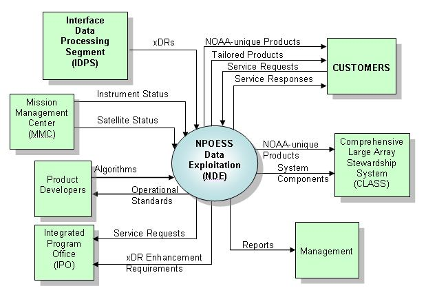
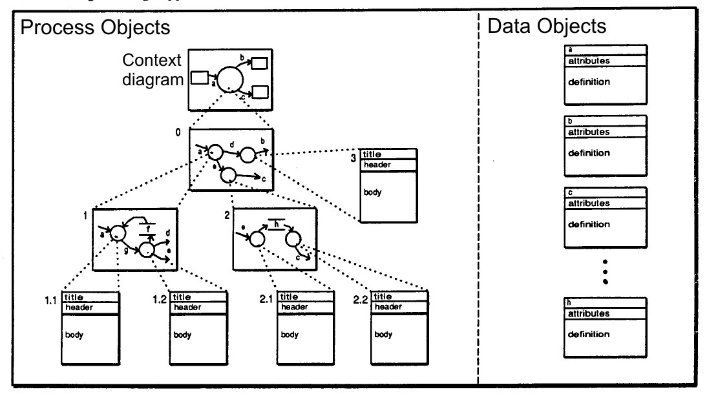
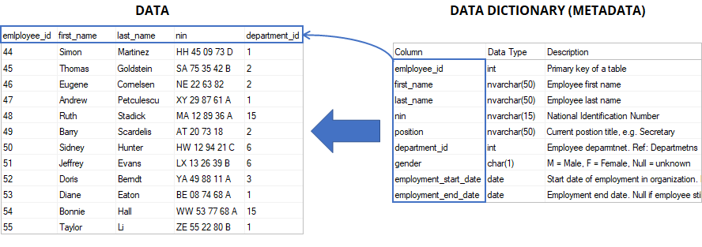

## 第 7 章 -- 系統分析

在開發一個軟體的過程當中，不管採用何種模式，通常還是會有《分析、設計、實作、上線》等階段。

這些階段在理想的《瀑布模式》上是不會回頭的，一路實施下去。

但是在《螺旋或敏捷》之類的模式下，則通常採用《小循環的方式》，每個小循環各自有自己的《分析、設計、實作、上線》階段。

《系統分析》是專案一開始就要進行的事項，通常可以進一步細分為下列子項目：

1. 可行性分析：確認專案目標以及可行性。
2. 需求分析：探詢並列出專案需求。
3. 系統分析：將需求規格化，讓設計人員可以掌握需求，不會誤解。這樣才能進一步進行《系統設計》。

> 進階閱讀： [維基百科:需求分析](https://zh.wikipedia.org/wiki/%E9%9C%80%E6%B1%82%E5%88%86%E6%9E%90)

### 需求分析

在早期、需求分析的重要性經常被低估，但是後來發現當《需求分析》有誤，其代價會比《後面的階段出錯》嚴重很多。

假如程式設計階段的錯誤代價為 1 ，那麼個階段出錯的代價很可能類似下列狀況：

1. 程式設計錯誤： 1
2. 系統設計錯誤： 10
3. 需求分析錯誤： 100

所以、很多經驗豐富的專案領導人會知道，探索需求是整個專案最重要，但是經常也是最難的一件事情。

《需求分析》要做的事情列舉如下：

1. 確認所有持有關鍵資訊的人
2. 從關鍵人物獲得可用的資訊
3. 把這些資訊轉化為清晰的和完整的形式
4. 考慮專案與解法是否可行
5. 考慮是否能在規定的時間裡完成
6. 考慮價格上是否負擔得起
7. 考慮是否合法或符合道德

但是這些事情的困難度往往被低估，分析的時候經常會遭遇以下困難或疑點：

1. 顧客方面的問題：
    * 顧客一開始所提出的需求，往往不完全、太樂觀或過分受到老系統的影響；
    * 顧客不明白他自己需要什麼
    * 顧客不願將他們的需要固定在一系列寫在紙上的條例中
    * 在價格和時間確定後，顧客堅持要求新的需要
    * 分析者與顧客的通訊太緩慢
    * 顧客缺乏技術上的知識
    * 顧客缺乏對軟體開發的知識
2. 軟體開發者方面的問題：
    * 軟體工程師與他們的顧客往往使用不同的詞彙，結果開發出來的軟體不符合顧客需求。
    * 軟體開發者希望《系統功能簡單一致，或者可以重用現有的程式碼》，但顧客卻希望《能符合現有流程或習慣》。
    * 軟體開發整不希望開發時經常修改規格，或者被客戶打擾而無法專注開發。

由於這兩方難以直接溝通，因此《系統分析師》就成了一個重要的角色！

在職場上，有時這個角色會分屬在不同職稱的人身上，像是《產品經理》、《專案主管》兩者，都可能在某整程度上扮演了《系統分析師的角色！

目前《系統分析設計》方法，通常是搭配《物件導向技術》的，物件導向分析方法中最廣為人知的是 UML 統一塑模語言 (Unified Modeling Language)。

但是在《物件導向分析技術》興起之前，《結構化分析技術》曾經是主流，讓我們先介紹一下《結構化分析技術》。

### 結構化分析與設計

結構化分析是因應《結構化程式設計》而誕生的《系統分析設計》方式，由於當時的程式語言沒有《物件》概念，程式的主角只有《函數》，而函數處理輸出入時則會用到《資料》。

還記得 Niklaus Wirth 這位圖靈獎級的程式語言大師曾經說過：

>  Algorithms + Data Structures = Programs

這句話反映了《結構化程式設計》時代的背景技術，演算法 Algorithms 代表的就是函數，而資料結構 Data Structures 代表的就是資料，這兩者的組合就形成了程式。

結構化分析時代的大師 Tom DeMarco 的分析方法就根據這樣的背景技術，設計了一系列的圖形與表格：

1. 系統關係圖
2. 資料流程圖
3. 資料字典
4. 程式規格

《系統關係圖》表達了最上層的《程序與資料》之互動關係，以下是一個範例：



《資料流程圖》是 Tom DeMarco 方法的關鍵，表達了《資料+函數》所形成的流動關係：



《資料字典》則描述了資料表格的欄位定義與用途，是資料專屬的描述方法：



(上圖來源: https://dataedo.com/kb/data-glossary/what-is-data-dictionary)

《程式規格》則描述了函數的輸入與輸出，以及函數應該達到的功能等等，是程式專屬的描述方法，這類描述其實就是 TDD/BDD 規格的口語化。其實差不多就是先前 jsdoc 當中所使用到的規格式說明：

```js
/**
 * Creates an array of elements split into groups the length of `size`.
 * If `array` can't be split evenly, the final chunk will be the remaining
 * elements.
 *
 * @memberof _
 * @since 0.1.0
 * @category Array
 * @param {Array} array The array to process.
 * @param {number} [size=1] The length of each chunk
 * @returns {Array} Returns the new array of chunks.
 * @example
 *
 * _.chunk(['a', 'b', 'c', 'd'], 2)
 * // => [['a', 'b'], ['c', 'd']]
 *
 * _.chunk(['a', 'b', 'c', 'd'], 3)
 * // => [['a', 'b', 'c'], ['d']]
 */
```

透過這些方式，逐漸描述出整個系統的結構，這就是所謂的《結構化分析設計方法》！

當然、這樣的方法是建構在《需求已經確定》的前提上，才能進行的規劃。

### UML 統一塑模語言

我們將採用 UML 這樣的《物件導向分析繪圖法》，搭配 [PlantUML](http://plantuml.com/) 這套工具進行 WebPos 的系統分析與設計，以下是 PlantUML 工具的網址，您可以看看其中的圖形，會對 UML 有一些基礎的概念。

* http://plantuml.com/

UML 的圖形很多，以下是一些常用的圖形，這些圖形是針對不同階段的規畫成果。

1. 使用個案圖 -- 分析階段
2. 類別圖 -- 設計階段
3. 循序圖 -- 設計階段
4. 活動圖 -- 設計階段
5. 狀態圖 -- 設計階段
6. 組件圖 -- 佈署階段
7. 佈署圖 -- 佈署階段

以下我們先分別看看這些圖形的範例，以便有個基本概念。

### 使用者故事 User Story

敏捷開發中建議使用 User Story 描述需求，

以下是經典網誌系統 BlogMVC 的 User Story : 

BlogMVC: User Story

1. 使用者可以檢視全部貼文列表
2. 使用者可以新增一筆貼文
    * 貼文按照新增時間由舊到新列出
3. 使用者可以檢視單一貼文內容
    * 包含標題 title 與內容 content

> 進階閱讀：  
> 1. https://en.wikipedia.org/wiki/User_story
> [10 TIPS FOR WRITING GOOD USER STORIES](https://www.romanpichler.com/blog/10-tips-writing-good-user-stories/)
> 2. [User Stories (1) 什麼是 User Story?](https://ihower.tw/blog/archives/2090)
> 3. [人人都該學習的技術：從 Idea 到成品，撰寫 User Story 的能力](http://blog.xdite.net/posts/2014/05/29/from-idea-to-product-user-story)


雖然敏捷開發中建議使用 User Story 的方式，但是也可以搭配 UML 使用，開發者可以用《手繪》的方式溝通，也可以用 UML 繪圖工具 (以方便敏捷為主要考量)。

### 使用個案圖

UML 的使用個案圖，和 User Story 類似卻又有些不同，上述的 User Story 若表達成《使用案例圖》會是這樣：


```puml
@startuml
left to right direction
使用者 --> (檢視貼文列表)
note right of (檢視貼文列表)
 貼文按照新增時間由舊到新列出
end note

使用者 --> (新增貼文)

使用者 --> (檢視貼文內容)
note right of (檢視貼文內容)
 包含標題 title 與內容 content
end note


@enduml
```


《使用個案圖》是系統分析時期的重點，雖然和物件導向技術沒有密切關係，但是卻能表達使用者與系統的互動關係，可以說是最上層的分析圖。

* http://plantuml.com/use-case-diagram

接著讓我們用另一個案例 WebPos 系統作示範：


```puml
@startuml
left to right direction
客戶 <<使用者>>
客戶 --> (註冊)
客戶 --> (登入)
note right of 登入 : 第一版不支援\nFacebook\nGoogle\n登入
客戶 --> (登出)
客戶 --> (搜尋商店)
(搜尋商店) .> (顯示商店列表) : include
客戶 --> (下訂單)
客戶 --> (客戶報表)
@enduml
```


《使用個案圖》完成之後，就可以進一步深入更詳細的《使用個案描述》，

```
使用個案名稱：下訂單

行為者：客戶

前提：剛進入時顯示空訂單

結束狀態：選好購物項目，並送交伺服器儲存

一系列之事件：

正常程序－
1. 客戶進入某商店之訂單畫面
2. 客戶選取商品並設定數量後放入訂單
3. 訂單畫面會不斷計算金額顯示給客戶看
  3.1 計算單項產品金額＝ 單價×數量 
  3.2 計算訂購總金額：Σ（單項產品金額）
4. 客戶可以連續訂購多項商品，訂購數量最多十項。
5. 客戶完成訂單，按下《送出按鈕》下訂

例外狀況 1 －
1. 客戶不慎選錯項目，可以按下放棄處理。
2. 此種情況將不會儲存該訂單紀錄。

例外狀況 2 －
1. 客戶不慎下錯訂單。
2. 此種情況在還沒生產之前，可以取消訂單。
3. 若已經付款，則必須進行退費處理。

例外狀況 3 －
1. 客戶發現訂單內容有誤
2. 此種情況在還沒付費之前，可以修改訂單。
3. 若已經付費但未生產，則可以取消訂單，進行退費處理。

```

當然、如果採用《敏捷式開發》，我們也可以用 User Story 進行上述描述，只是 User Story 建議採用下列方式敘述。

> As a (role) I can (capability), so that (receive benefit)
> 作為 (特定角色) ，我可以 (怎麼做)，才能 (達成任務)

這種敏捷式的 User Story 比較彈性，用起來也會輕鬆很多，或許也算是一種易用的 [文件驅動開發](https://gist.github.com/zsup/9434452?fbclid=IwAR2FVYJMmGpmeZapF2W9DzasSFmd9ro_I6qM4KDNu3GjpeZsosYvgCjnbew) (Document Driven Development, DDD) 方法。

> 進階閱讀
> 
> 1. [Use Case Description（描述使用案例）](http://relyky.blogspot.com/2010/03/use-case-description.html)
> 2. [用例: Use Case](https://zh.wikipedia.org/wiki/%E7%94%A8%E4%BE%8B)

### 再論軟體開發模式

理想的軟體工程實施方式，應該是按著《分析 => 設計 => 實作 => 佈署》的步驟進行，雖然也可以採用迭代循環，分成很多個螺旋，但每個螺旋裡都會有《分析 => 設計 => 實作 => 佈署》等步驟。

不過、真正要實施的時候，常常都很難按照《分析 => 設計 => 實作 => 佈署》的步驟依次進行。

真正的系統開發的順序經常會是《交互穿插》的，我們可能先進行簡單的分析，然後開立設計規格，之後實作幾個函數，接著撰寫測試程式，測試過了之後又繼續分析 ...

也可能先寫個程式範例、從該範例得到一些技術經驗之後，之後擴大一點，然後撰寫測試程式，等到最後再來繪製設計圖，然後才知道整個系統應該長甚麼樣。

而這樣的過程，就很難區分《分析 => 設計 => 實作 => 佈署》等階段，因為各個階段經常是混合再一起，一天之內可能既要《修改程式》、又要作《分析、設計》，甚至還要《佈署很多次》。

因此在敏捷開發方法當中，就乾脆不區分這些階段，甚至也不區分職務，每個人都要負責《寫程式、測試、分析、設計、佈署》等等工作。

### 練習


### 練習 1 -- 使用 PlantUML

1. 安裝 PlantUML
    * http://plantuml.com/
2. 安裝 VsCode 的 Markdown Preview Enhanced 插件
    * Markdown Preview Enhanced 對 Markdown 按 Ctrl-K-V 可以預覽
    * Markdown Preview Enhanced 支援很多功能，請參考：https://shd101wyy.github.io/markdown-preview-enhanced/#/zh-tw/
    * 單獨的 PlantUML 的副檔名必須要是 puml 才能正確顯示。(預覽用 Alt-D)

特別推薦：雖然一直在用，但仔細一看才發現Markdown Preview Enhanced 這個 vscode 插件功能是如此強大，根本神器阿！
* 支援 markdown, plantUML, laTex
* 還支援 Code Chunk, ER-Diagram, Matplotlib, tikz(畫電路圖) ...
  * https://shd101wyy.github.io/markdown-preview-enhanced/#/zh-tw/code-chunk
* 支援幻燈片
  * https://shd101wyy.github.io/markdown-preview-enhanced/#/zh-tw/presentation
* 支援寫電子書，用 pandoc 輸出
  * https://shd101wyy.github.io/markdown-preview-enhanced/#/zh-tw/ebook


### 練習 2 -- 經典網誌系統的分析 (下一版)

1. 請寫出 網誌系統的 User Story ，並畫出使用個案圖 (Use Case)。
2. 請根據前一項更詳細的繪出其循序圖 ...
3. 請寫出或繪出該系統的類別圖 (有幾個類別，分別有哪些函數)
4. 請設計出該系統的使用者介面，搭配 usecase 與 sequence diagram. 
