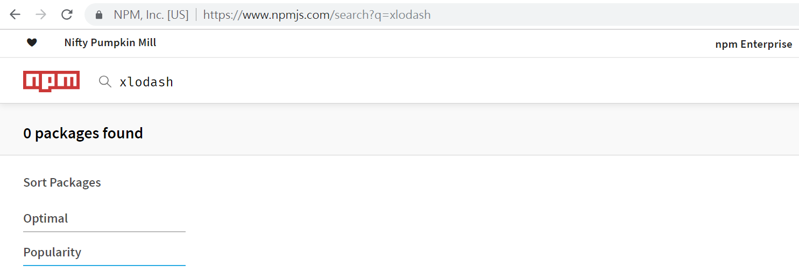

## 第 3 章 -- NPM 套件

Npm (Node Package Manager) 是 Node.js 裡面的套件管理工具，可以用來《安裝、創建、更新、發布套件》。

正是因為有了 npm ，所以我們才能輕易地用 npm i lodash 這樣的指令安裝套件。

但是只會安裝套件是不夠的，我們還必須學會發佈套件，這就是本章的第一個重點。

### 創建套件

如果您想發布一個套件，可以使用 npm init 創建套件，以下是我創建 ccclodash 套件的過程。

```
PS D:\course\test> mkdir xlodash


    目錄: D:\course\test


Mode                LastWriteTime         Length Name
----                -------------         ------ ----
d-----     2018/10/19  上午 07:54                xlodash


PS D:\course\test> cd xlodash
PS D:\course\test\xlodash> npm init

This utility will walk you through creating a package.json file.
It only covers the most common items, and tries to guess sensible defaults.

See `npm help json` for definitive documentation on these fields
and exactly what they do.

Use `npm install <pkg>` afterwards to install a package and
save it as a dependency in the package.json file.

Press ^C at any time to quit.
package name: (xlodash)
version: (1.0.0) 0.0.1
description: 練習重新實作 lodash 的幾個函數
entry point: (index.js)
test command: mocha
git repository:
keywords: lodash library
author: ccc
license: (ISC) MIT
About to write to D:\course\test\xlodash\package.json:

{
  "name": "xlodash",
  "version": "0.0.1",
  "description": "練習重新實作 lodash 的幾個函數",
  "main": "index.js",
  "scripts": {
    "test": "mocha"
  },
  "keywords": [
    "lodash",
    "library"
  ],
  "author": "ccc",
  "license": "MIT"
}


Is this ok? (yes) yes
PS D:\course\test\xlodash> ls


    目錄: D:\course\test\xlodash


Mode                LastWriteTime         Length Name
----                -------------         ------ ----
-a----     2018/10/19  上午 07:55            258 package.json
```

當您完成這樣的動作，xlodash 資料夾下會出現一個名稱為 package.json 的檔案，內容如下：

```json
{
  "name": "xlodash",
  "version": "0.0.1",
  "description": "練習重新實作 lodash 的幾個函數",
  "main": "index.js",
  "scripts": {
    "test": "mocha"
  },
  "keywords": [
    "lodash",
    "library"
  ],
  "author": "ccc",
  "license": "MIT"
}
```

接著您只要寫好程式，並以 index.js 為主模組，就可以發佈套件了！

例如我們的 xlodash 實作了 chunk 這個函數如下：

```js
const _ = (module.exports = {})

// _.chunk(['a', 'b', 'c', 'd'], 2) => [['a', 'b'], ['c', 'd']]
// _.chunk(['a', 'b', 'c', 'd'], 3) => [['a', 'b', 'c'], ['d']]
_.chunk = function (list, n) {
  const clist = []
  for (let i = 0; i < list.length; i += n) {
    clist.push(list.slice(i, i + n))
  }
  return clist
}
```

當然我們必須要測試一下該套件是否正常，所以先寫一個 chunkTest.js 測試程式。

```js
const assert = require('assert')
const _ = require('../index')

describe('ccclodash', function () {
  describe('chunk', function () {
    it("_.chunk(['a', 'b', 'c', 'd'], 2) equalTo [ [ 'a', 'b' ], [ 'c', 'd' ] ]", function () {
      assert.deepStrictEqual(_.chunk(['a', 'b', 'c', 'd'], 2), [
        ['a', 'b'],
        ['c', 'd']
      ])
    })
    it("_.chunk(['a', 'b', 'c', 'd'], 3) equalTo [ [ 'a', 'b', 'c' ], [ 'd' ] ]", function () {
      assert.deepStrictEqual(_.chunk(['a', 'b', 'c', 'd'], 3), [
        ['a', 'b', 'c'],
        ['d']
      ])
    })
    it("_.chunk(['a', 'b', 'c', 'd'], 3) notEqualTo [ [ 'a', 'b'], ['c' , 'd' ] ]", function () {
      assert.notDeepStrictEqual(_.chunk(['a', 'b', 'c', 'd'], 3), [
        ['a', 'b'],
        ['c', 'd']
      ])
    })
  })
})

```

然後測試看看：

```
PS D:\course\test\xlodash> mocha


  ccclodash
    chunk
      √ _.chunk(['a', 'b', 'c', 'd'], 2) equalTo [ [ 'a', 'b' ], [ 'c', 'd' ] ]
      √ _.chunk(['a', 'b', 'c', 'd'], 3) equalTo [ [ 'a', 'b', 'c' ], [ 'd' ] ]
      √ _.chunk(['a', 'b', 'c', 'd'], 3) notEqualTo [ [ 'a', 'b'], ['c' , 'd' ] ]


  3 passing (91ms)
```

沒問題之後，我們應該先寫個 README.md 檔案，讓使用者知道如何用我們的套件。

接著就可以發布該套件了，發布前先到 npm 網站檢查一下 xlodash 這個名稱是否可用 (如果已經被別人佔用了，就得換名字) ，



如果該名稱是可用的，那麼就可以準備發布了。

發布前你必須先到 npm 官網註冊一個帳戶。

* https://www.npmjs.com/signup

註冊好之後，你必須先在本機用 npm login 登入 (或者用 npm add user ....) ，然後再使用 npm publish ./ 上傳發布。

```
PS D:\course\test\xlodash> npm publish ./

+ xlodash@0.0.1
```

這樣就發布完成了，我們可以到該專案的網址去看看是否真的有發布上去。

* https://www.npmjs.com/package/xlodash

這樣我們就發佈了一個自己寫的 npm 套件！

### 發佈更新版

如果您對程式進行改版更新，必須要先用 npm version 指令更新版本號之後，才能再次發佈！

```
PS D:\course\test\xlodash> npm version patch
v0.0.2
PS D:\course\test\xlodash> npm publish ./
+ xlodash@0.0.2
```

npm version 指令後面接 patch 會更新最小版本號，也就是 0.0.1 會變成 0.0.2 。

若用 npm version minor，則版本號 0.0.1 會直接升到 0.1.0。 (次版本號更新)

若用 npm version major，則版本號 0.0.1 會快速升到 1.0.0。 (主版本號更新)

### 新增相關套件

假如我們設計的套件，有用到其他 npm 套件，那麼可以用 `npm i 套件名稱 --save` 來安裝，這樣在安裝後就會更新 package.json ，加入  dependencies 欄位，於是當別人安裝你的套件時，這些相關套件也會一併安裝，這樣才不會導致使用者的困擾。

但是有些相關套件並非給一般安裝者使用的，而是給想修改測試你套件的人使用的，這時你就應該加上 --save-dev 參數，如以下範例所示：

```
PS D:\course\test\xlodash> npm i mocha --save-dev
npm notice created a lockfile as package-lock.json. You should commit this file.
npm WARN xlodash@0.0.2 No repository field.

+ mocha@5.2.0
added 24 packages in 15.725s
```

此時 package.json 會變成這樣

```json
{
  "name": "xlodash",
  "version": "0.0.2",
  "description": "練習重新實作 lodash 的幾個函數",
  "main": "index.js",
  "scripts": {
    "test": "mocha"
  },
  "keywords": [
    "lodash",
    "library"
  ],
  "author": "ccc",
  "license": "MIT",
  "devDependencies": {
    "mocha": "^5.2.0"
  }
}
```

多出了 "devDependencies": { "mocha": "^5.2.0"  } 這一段，如果有人透過 git clone 抓下你的專案時，就可以用 npm i 指令將相關套件一次安裝好。(關於 git 的用法，我們會在下一章講解)

### 練習 1 -- 創建並發布 npm 套件

> 基本參考：https://github.com/cccbook/sejs/tree/master/example/03-npm
> 進階參考: https://github.com/cccbook/sejs/project/ccclodash


請延續 《上一個練習》，將你的套件出版在 npm 上

1. 使用 npm init 建立你的專案檔 (package.json)
    * 參考 ： https://docs.npmjs.com/cli/init
2. 將《上一個練習》的程式加到你的資料夾中，記得設好 main 欄位！
    * https://docs.npmjs.com/files/package.json
3. 將測試指令 mocha 加入 package.json 中，並用 npm run test 測試。
    * https://docs.npmjs.com/misc/scripts
4. 將相關套件加入你的 package.json 當中，讓使用者可以用 npm i 安裝所有相關套件。
    * https://docs.npmjs.com/files/package.json
5. 上 npm 網站申請帳號
    * https://www.npmjs.com/login
6. 然後用 npm login (或 npm adduser) 確認你可以用該帳號登入。
    * https://docs.npmjs.com/cli/adduser
7. 上 npm 網站查詢，選定一個可用的套件名稱
    * https://www.npmjs.com/
8. 然後用 npm publish 指令發布你的套件。
    * https://docs.npmjs.com/cli/publish
9. 看看你發布的套件是否成功，檢查下列網址 (此時你會發現你的套件沒有說明)
    * https://www.npmjs.com/package/你的套件名稱
10. 撰寫你 npm 套件的 README.md 檔案，為套件加上說明。
    * 參考 : https://zh.wikipedia.org/wiki/Markdown (markdown 語法的參考)
11. 再次用 npm publish 發布你的套件，檢查下列網址
    * https://www.npmjs.com/package/你的套件名稱
    * npm 套件的發布常常會延時，要過比較久才看得到，您可以在 yarn 看看該套件是否發布完成
    * (yarn 比較快，算是 npm 的競爭對手 ....)
    * https://yarnpkg.com/zh-Hans/package/你的套件名稱
12. 用 npm i 你的套件名稱 安裝並寫一個測試程式，看看你的套件是否正常運作。

完整參考: https://github.com/se107a/ccclodash

學完這章您應該已經具備《撰寫套件發佈給其他人使用的能力了》，下一章的重點將會是培養使用《GIT 合作》的能力！
