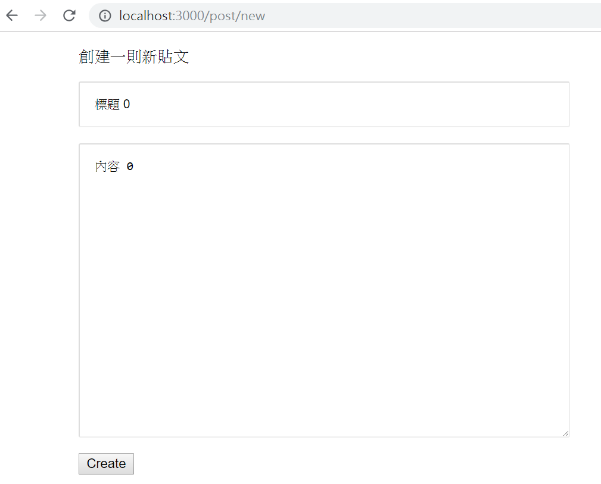
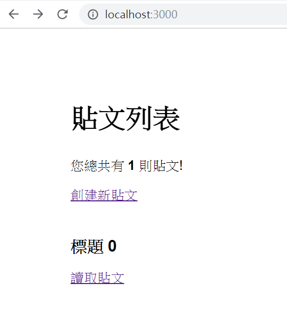
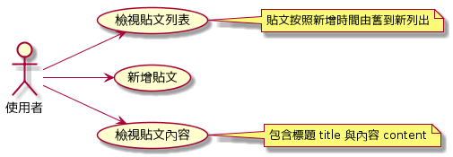
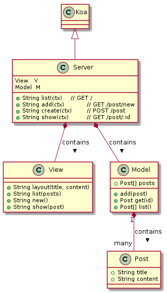
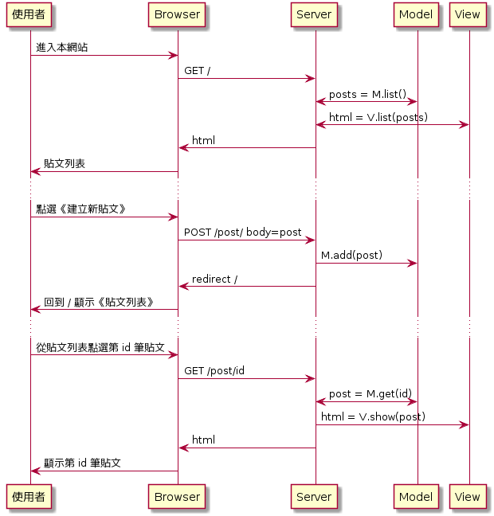

## 案例 1.1 -- 網誌經典版

我們將 [koa 官方的 Blog 範例](https://github.com/koajs/examples/tree/master/blog) 修改之後，成為《BlogMVC 簡易網誌系統》並進行測試，您可以在下列網址看到 BlogMVC 專案完整的程式碼：

* https://github.com/cccbook/sejs/tree/master/project/blogMvc

讓我們先展示一下該系統地執行結果，首先是執行畫面：


當我們按下《創建新貼文》連結後，會進入以下畫面：



接著填寫標題內容後送出，會回到執行畫面，然後顯示有一筆貼文：



當我們點進該貼文之後，會顯示貼文內容：


上述程式雖然已經建構完成了，但是在完成之後再透過對該程式進行分析，除了可以讓程式的結構更清楚，也可以趁機學會《系統分析與設計》的那些能力。

在此我們將採用 UML 的方式，對 BlogMVC 進行分析設計，以便學習完整的 《UML 分析、設計、實作、測試》的能力。

### 分析

UML 的使用個案圖，和 Scrum 中的 User Story 用途類似，只是表達方法不同，我們在此都做一遍。

### User Story

1. 使用者可以檢視全部貼文列表
2. 使用者可以新增一筆貼文
    * 貼文按照新增時間由舊到新列出
3. 使用者可以檢視單一貼文內容
    * 包含標題 title 與內容 content

### 使用個案圖

```puml
@startuml
left to right direction
使用者 --> (檢視貼文列表)
note right of (檢視貼文列表)
 貼文按照新增時間由舊到新列出
end note

使用者 --> (新增貼文)

使用者 --> (檢視貼文內容)
note right of (檢視貼文內容)
 包含標題 title 與內容 content
end note

@enduml
```

顯示結果




### 設計

BlogMVC 採用經典網站設計方式，也就是全部的資訊都在 Server 端生成後傳回，因此沒有用到《前端 JavaScript 技術》。

### 設計模式

在 BlogMVC 專案中我們採用 MVC (Model-View-Controller) 模式，其中的 Controller 就是主程式 Server.js。

* Model : model.js
    * 資料的存取
* View : view.js
    * 畫面的顯示
* Controller : Server.js
    * 伺服器主程式，採用 koa 伺服端框架，負責調用 model 與 view 


### 類別圖

```puml
@startuml
class Server extends Koa {
  View   V
  Model  M

  +String list(ctx)   \t// GET /
  +String add(ctx)    \t// GET /post/new
  +String create(ctx) \t// POST /post
  +String show(ctx)   \t// GET /post/:id
}

class View {
  +String layout(title, content)
  +String list(posts)
  +String new()
  +String show(post)
}

class Model {
  +Post[] posts

  +{method} add(post)
  +Post get(id)
  +Post[] list()
}

class Post {
  +String title
  +String content
}


Server *-- Model : contains >
Server *-- View : contains >
Model "1"*--"many" Post : contains >
@enduml

```

呈現結果



### 循序圖

類別與函數都確定後，就可以用《循序圖》描述詳細的互動關係。

```puml
@startuml
使用者 -> Browser : 進入本網站
Browser -> Server : GET /
Server <-> Model : posts = M.list()
Server <-> View : html = V.list(posts)
Server -> Browser  : html
Browser -> 使用者 : 貼文列表
...
使用者 -> Browser : 點選《建立新貼文》
Browser -> Server : POST /post/ body=post
Server -> Model : M.add(post)
Server -> Browser : redirect /
Browser -> 使用者 : 回到 / 顯示《貼文列表》
...
使用者 -> Browser : 從貼文列表點選第 id 筆貼文
Browser -> Server : GET /post/id
Server <-> Model : post = M.get(id)
Server -> View : html = V.show(post)
Browser <- Server : html
使用者 <- Browser : 顯示第 id 筆貼文
@enduml
```

呈現結果




### BDD 測試

以上《簡易網誌系統》測試的《使用者故事》，若寫成 [RESTful](https://zh.wikipedia.org/zh-tw/%E8%A1%A8%E7%8E%B0%E5%B1%82%E7%8A%B6%E6%80%81%E8%BD%AC%E6%8D%A2) 形式，可以寫成下列故事：

* GET / : 
    * 傳回《貼文列表》\n目前只有 0 則貼文
* POST /post/ : body={ title: '貼文 0', body: '內容 0' }
    * 應該會創建新貼文 (post 0)，然後轉址到根目錄 / 後顯示《貼文列表》
* GET /post/0 : 
    * 應該會看到第 0 則貼文

若使用 UML 當中的《循序圖》(Sequence Diagram) 描述該案例，則可繪製出下列的《測試案例循序圖》：

```puml
@startuml
使用者 -> Browser : 進入網站
Browser -> Server : GET /
Server -> Browser  : 顯示《貼文列表》
Browser -> 使用者 : <p>您總共有 <strong>0</strong> 則貼文!</p>
...
使用者 -> Browser : 輸入貼文\n{ title: '標題 0', body: '內容 0' }
Browser -> Server : POST /post/ 儲存新貼文\nbody={ title: '標題 0', body: '內容 0' }
Server -> Browser  : 儲存貼文後轉址到 /
Browser -> 使用者 : / 顯示《貼文列表》
...
Browser -> Server : GET /post/0
Browser <- Server : 顯示第 0 則貼文
使用者 <- Browser : <h1>標題 0</h1>\n<p>內容 0</p>
@enduml
```

呈現結果


透過這樣的分析，要寫出測試程式 test.js 就容易了。

* https://github.com/cccbook/sejs/blob/master/project/blogMvc/test.js

```js
/* eslint-env mocha */
const expect = require('chai').expect
const server = require('./server').listen()
const request = require('supertest').agent(server)

describe('簡易網誌系統', function () {
  after(function () {
    server.close()
  })

  describe('GET /', function () { // 路徑 GET /
    it('內文標題應該為《貼文列表》，而且只有 0 則貼文', function (done) {
      request.get('/').expect(200, function (err, res) {
        if (err) return done(err)

        expect(res.header['content-type']).to.include('html') // 根目錄是個 html 文件
        expect(res.text).to.include('<title>貼文列表</title>') // 內文標題為 Posts
        expect(res.text).to.include('<p>您總共有 <strong>0</strong> 則貼文!</p>')
        done()
      })
    })
  })

  describe('POST /post', function () { // 路徑 POST /post/new
    it('應該會創建新貼文，然後轉址到根目錄 /', function (done) {
      request
        .post('/post')
        .send({ title: '貼文 0', body: '內容 0' })
        .end(function (err, res) {
          if (err) return done(err)

          expect(res.header.location).to.equal('/') // 路徑 / => 根目錄是個 html 文件
          done()
        })
    })
  })

  describe('GET /post/0', function () {
    it('應該會看到第 0 則貼文', function (done) {
      request.get('/post/0').expect(200, function (err, res) {
        if (err) return done(err)

        expect(res.header['content-type']).to.include('html')
        expect(res.text).to.include('<h1>貼文 0</h1>')
        expect(res.text).to.include('<p>內容 0</p>')
        done()
      })
    })
  })
})

```

測試案例的執行結果：

```
PS D:\course\sejs\project\blogMvc> mocha


  簡易網誌系統
    GET /
  <-- GET /
  --> GET / 200 30ms 1.13kb
      √ 內文標題應該為《貼文列表》，而且只有 0 則貼文 (116ms)
    POST /post
  <-- POST /post
  --> POST /post 302 81ms 33b
      √ 應該會創建新貼文，然後轉址到根目錄 / (97ms)
    GET /post/0
  <-- GET /post/0
  --> GET /post/0 200 3ms 1.02kb
      √ 應該會看到第 0 則貼文


  3 passing (288ms)
```

### 實作 

Server.js 的原始碼如下：

* https://github.com/cccbook/sejs/tree/master/project/blogMvc/server.js

```js
const V = require('./view')
const M = require('./model')
const logger = require('koa-logger')
const router = require('koa-router')()
const koaBody = require('koa-body')

const Koa = require('koa')
const server = module.exports = new Koa()

server.use(logger())
server.use(koaBody())

router.get('/', list)
  .get('/post/new', add)
  .get('/post/:id', show)
  .post('/post', create)

server.use(router.routes())

async function list (ctx) {
  const posts = M.list()
  ctx.body = await V.list(posts)
}

async function add (ctx) {
  ctx.body = await V.new()
}

async function show (ctx) {
  const id = ctx.params.id
  const post = M.get(id)
  if (!post) ctx.throw(404, 'invalid post id')
  ctx.body = await V.show(post)
}

async function create (ctx) {
  const post = ctx.request.body
  M.add(post)
  ctx.redirect('/')
}

if (!module.parent) {
  server.listen(3000)
  console.log('Server run at http://localhost:3000')
}

```

而負責資料存取的 model 模組之原始碼如下：

* https://github.com/cccbook/sejs/tree/master/project/blogMvc/model.js

```js
const M = module.exports = {}

const posts = []

M.add = function (post) {
  const id = posts.push(post) - 1
  post.created_at = new Date()
  post.id = id
}

M.get = function (id) {
  return posts[id]
}

M.list = function () {
  return posts
}

```

負責呈現畫面的 view 模組之原始碼如下：

* https://github.com/cccbook/sejs/tree/master/project/blogMvc/view.js

```js
var V = module.exports = {}

V.layout = function (title, content) {
  return `
  <html>
  <head>
    <title>${title}</title>
    <style>
      body {
        padding: 80px;
        font: 16px Helvetica, Arial;
      }
  
      h1 {
        font-size: 2em;
      }
  
      h2 {
        font-size: 1.2em;
      }
  
      #posts {
        margin: 0;
        padding: 0;
      }
  
      #posts li {
        margin: 40px 0;
        padding: 0;
        padding-bottom: 20px;
        border-bottom: 1px solid #eee;
        list-style: none;
      }
  
      #posts li:last-child {
        border-bottom: none;
      }
  
      textarea {
        width: 500px;
        height: 300px;
      }
  
      input[type=text],
      textarea {
        border: 1px solid #eee;
        border-top-color: #ddd;
        border-left-color: #ddd;
        border-radius: 2px;
        padding: 15px;
        font-size: .8em;
      }
  
      input[type=text] {
        width: 500px;
      }
    </style>
  </head>
  <body>
    <section id="content">
      ${content}
    </section>
  </body>
  </html>
  `
}

V.list = function (posts) {
  let list = []
  for (let post of posts) {
    list.push(`
    <li>
      <h2>${post.title}</h2>
      <p><a href="/post/${post.id}">讀取貼文</a></p>
    </li>
    `)
  }
  let content = `
  <h1>貼文列表</h1>
  <p>您總共有 <strong>${posts.length}</strong> 則貼文!</p>
  <p><a href="/post/new">創建新貼文</a></p>
  <ul id="posts">
    ${list.join('\n')}
  </ul>
  `
  return V.layout('貼文列表', content)
}

V.new = function () {
  return V.layout('新增貼文', `
  <h1>新增貼文</h1>
  <p>創建一則新貼文</p>
  <form action="/post" method="post">
    <p><input type="text" placeholder="Title" name="title"></p>
    <p><textarea placeholder="Contents" name="body"></textarea></p>
    <p><input type="submit" value="Create"></p>
  </form>
  `)
}

V.show = function (post) {
  return V.layout(post.title, `
    <h1>${post.title}</h1>
    <p>${post.body}</p>
  `)
}

```


### 結語

以上是 BlogMVC 經典網誌的案例，應該能完整的展現《server 為主的網站系統》的《分析、設計、實作、與測試》過程。

這種經典網站可以採用 supertest 測試就行了，但是如果有使用 AJAX 技術，或者有《前端 JavaScript》程式的網站，就不能只採用 supertest 進行測試了，而必須要使用 Puppeteer 或 Selenium 等 Headless Browser 《隱藏式瀏覽器》了。


