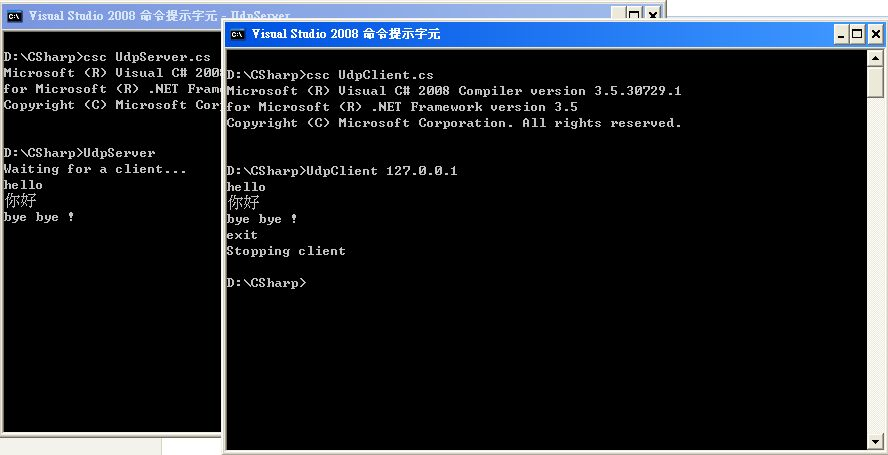

# C# 網路程式：UDP 程式設計

## UDP 簡介

UDP 是網路程式設計當中，最簡單的一種模式。本文將介紹如何使用 C# 撰寫 UDP 的『傳送-接收程式』。

UDP 程式的架構：使用 UDP 方式傳送訊息，由於封包是以一個一個的方式分別傳輸，先傳送者不一定會先到，甚至於沒有到達也不進行處理。由於這種方式不是連線導向的方式，因此不需要記住連線的 Socket，只要直接用 Socket 當中的 ReceiveFrom(data, ref Remote) 函數即可。

UDP 的程式必須有『傳送-接收』兩端，通常傳送端稱為 Client，接收端稱為 Server，以下是一個 UDP Client-Server 的 C# 程式架構。

客戶端：傳送訊息的 Client

```CS
IPEndPoint ip = new IPEndPoint(address, port);
Socket server = new Socket(AddressFamily.InterNetwork, SocketType.Dgram, ProtocolType.Udp);
....
while(true) {
     ...
     server.SendTo(data, ip);
}
...
server.Close();
```

伺服端：接收訊息的 Server

```CS
ip = new IPEndPoint(IPAddress.Any, port);
socket = new Socket(AddressFamily.InterNetwork, SocketType.Dgram, ProtocolType.Udp);
socket.Bind(ipep);
...
while(true) {
  byte[] data = new byte[size];
  int recv = socket.ReceiveFrom(data, ref Remote);
  ...
}
```

為了說明 UDP 網路程式的設計方式，我們設計了一個單向的 UDP 聊天程式專案，這個專案包含 UdpClient.cs 與 UdpServer.cs 等兩個 C# 的程式。使用者可以在 UdpClient 當中輸入要傳送給 UdpServer 的訊息，而程式會忠實的將訊息從 Client 傳送到 Server 中。當使用者輸入 exit 的時候，Client 程式將會結束，以下是該程式執行時的畫面。



## 單向 UDP 訊息傳遞程式

以下是一個 UDP 客戶端 UdpClient，該客戶端會接受使用者的輸入，然後將訊息傳遞給伺服端的 UdpServer。

檔案：UdpClient.cs

```CS
using System;
using System.Net;
using System.Net.Sockets;
using System.Text;

public class UdpClient
{
    public static void Main(string[] args)	// 主程式開始
    {
    	// 連接到 args[0] 參數所指定的 Server，使用連接埠 5555
    	IPEndPoint ipep = new IPEndPoint(IPAddress.Parse(args[0]), 5555);
    	// 建立 Socket，連接到 Internet (InterNetwork)，使用 Udp 協定的 Datagram 方式 (Dgram)。
    	Socket server = new Socket(AddressFamily.InterNetwork, SocketType.Dgram, ProtocolType.Udp);
    	while(true)	 // 不斷讀取鍵盤輸入，並傳送輸入訊息給伺服器。
    	{
    	 string input = Console.ReadLine();	// 讀取鍵盤輸入
    	 if (input == "exit")	// 如果輸入為 exit，則強制離開程式。
    	 break;
    	 server.SendTo(Encoding.UTF8.GetBytes(input), ipep);	// 將訊息以 UTF8 的方式編碼後傳出。
    	}
    	Console.WriteLine("Stopping client");	// 印出 Stopping client 訊息。
    	server.Close();	// 關閉連線。
    }
}
```

以下是一個 Udp 的伺服端，利用無窮迴圈接收上述客戶端傳來的訊息，然後列印在螢幕上。

檔案：UdpServer.cs

```CS
using System;
using System.Net;
using System.Net.Sockets;
using System.Text;

public class UdpServer
{
    public static void Main()
    {
    	// 開啟伺服器的 5555 連接埠，用來接收任何傳送到本機的訊息。
    	IPEndPoint ipep = new IPEndPoint(IPAddress.Any, 5555);
    	// 建立接收的 Socket，並使用 Udp 的 Datagram 方式接收。
    	Socket newsock = new Socket(AddressFamily.InterNetwork, SocketType.Dgram, ProtocolType.Udp);
    	// 綁定 Socket (newsock) 與 IPEndPoint (ipep)，讓 Socket 接收 5555 埠的訊息。
    	newsock.Bind(ipep);
    	Console.WriteLine("Waiting for a client..."); // 顯示 Waiting for client ...。
    	// 建立 Remote 物件以便取得封包的接收來源的 EndPoint 物件。
    	IPEndPoint sender = new IPEndPoint(IPAddress.Any, 0); 
    	EndPoint Remote = (EndPoint)(sender);
    	while(true) // 無窮迴圈，不斷接收訊息並顯示到螢幕上。
    	{
    	 byte[] data = new byte[1024]; // 設定接收緩衝區的陣列變數。
    	 int recv = newsock.ReceiveFrom(data, ref Remote); // 接收對方傳來的封包。
    	 // 將該封包以 UTF8 的格式解碼為字串，並顯示到螢幕上。
    	 Console.WriteLine(Encoding.UTF8.GetString(data, 0, recv)); 
    	}
    }
}
```

程式說明：

在上述程式當中，讀者會看到兩個無窮迴圈，這在網路程式設計領域是很常見的。Server 通常是一個由無窮迴圈所構成的程式，該程式不斷的接收由 Client 所傳來的訊息，然後進行處理與顯示。

程式中的 IPEndPoint 所代表的就是 TCP/IP 協定中的 IP 層，也就是網址。建構函數 new IPEndPoint(address, port) 有兩個參數，第一個是 IP 地址 (address)，第二個是連接埠 (port)。這個物件在撰寫 Client 與 Server 時都會用到。

在 UdpClient 的程式中，我們直接利用下列程式連接到 Server，您可以使用

    IPEndPoint ipep = new IPEndPoint(IPAddress.Parse(args[0]), 5555);

UdpServer 程式中的 new IPEndPoint(IPAddress.Any, 5555) 會開啟該伺服器電腦的 5555 這個連接埠 (port)，讓其他程式可以透過網路傳送訊息給該程式。一但某程式開啟了特定連接埠，就會霸佔該連接埠。作業系統不會允許其他程式再度開啟這個連接埠，因為該連接埠已經被用掉了。

讀者可能會對其中的 IPAddress.Any 的用意感到納悶，為何不是指定本機的 IP，而是用 IPAddress.Any 呢？

## 參考文獻
* MSDN/.NET Framework 類別庫/Socket 類別 -- <http://msdn.microsoft.com/zh-tw/library/system.net.sockets.socket(VS.80).aspx>
* Socket.ReceiveFrom 方法 -- <http://msdn.microsoft.com/zh-tw/library/wdfskwcy(VS.80).aspx>

