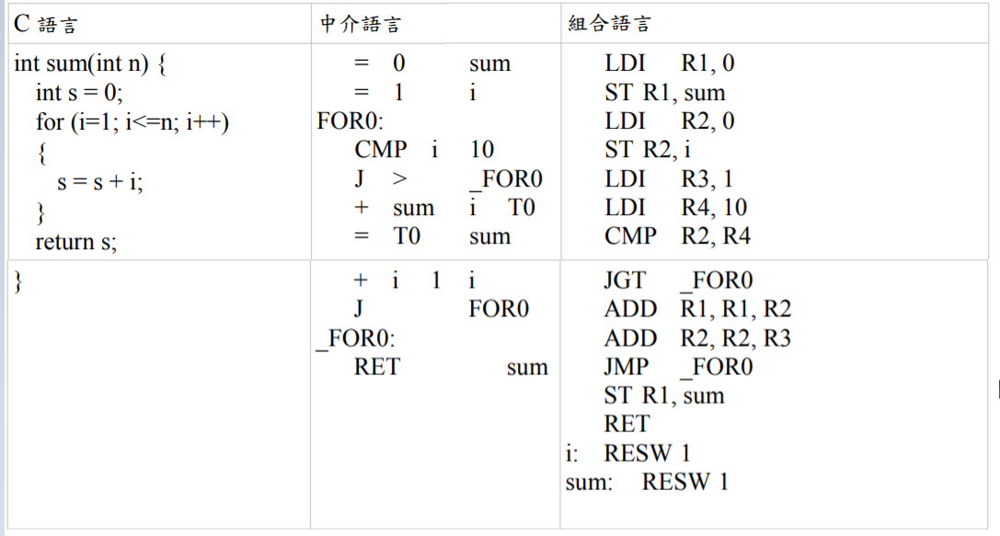

## 語言處理簡介

談到語言，一般人會想到「英文、中文、法語、日語」等等語言，這些語言是在人類歷史發展的過程當中逐漸被建構出來的，沒有任何人可以說他「設計出了中文」、「發明了英文」或「創造了法語」。

### 自然語言

這種由歷史過程衍生出來的語言稱為「自然語言」，在資訊工程的領域，這是「自然語言處理」這個學科所必須面對與研究的課題。但是在一般領域，「自然語言」則是「語言學」所討論的議題。

自然語言並非刻意「設計出來的」，但是、有些語言卻是由某個人從無到有所創造設計出來的，像是「C 語言、Python、JavaScript、Ruby、Perl 」等程式語言，我們都可以查到其發明人是誰？這類的語言稱為人造語言。這種語言通常有非常明確固定的語法，我們可以透過電腦程式去「解釋」這些語言的語法，然後做出對應的動作。

除了「自然語言」與「人造語言」之外，還有一種語言，是將兩者混合所形成的語言，這種語言通常稱為標記語言，像是「HTML、XML、維基語言、Markdown、ReStructuredText」等，這類的語言乃是在自然語言上進行一些標記，以便讓程式可以透過標記進行對應的動作，像是加上粗體、加上超連結、顯示成表格、或者單純只是標記某個區塊的特性，像是 XML 的標記就是如此。

### 人造語言

人造語言的種類很多，但大部分都是程式類的語言，像是高階語言 (像是 C、Ruby、Python)、組合語言 (像是 x86、ARM、CPU0 的組合語言)、還有高階語言在翻譯成組合語言之前通常會經過某種中介語言等等，以下是一些人造語言的範例。

「計算語言學」就是研究如何透過電腦這個計算工具，用程式處理「自然語言、人造語言與標記語言」的一門學問。

### 語言的處理

電腦對於語言文字的處理方法，在程式語言上面已經相當得成熟，編譯器可以很容易的將高階語言程式轉換成組合語言或機器碼。

另外、解譯器也很容易的可以執行程式，甚至也可以設計出一種稱為 Just in time (JIT) Compiler 的「編解譯混合技術」，在解譯過程中以編譯的方式去執行程式，這樣可以讓執行的速度變得更快，像是Java 的 JVM 與 Google 的 JavaScript V8 JIT 引擎，都是採用這種混合模式製作的。

但是對於「自然語言的處理」而言，目前的電腦技術就顯得相當力不從心了，雖然 2015 年開始《深度學習 RNN/LSTM 循環神經網路》已經對自然語言處理，特別是機器翻譯的品質改進了很多，但是仍然難以達到人類的翻譯水準！

### 語言的意義

如前所述，我們在「自然語言完全理解」的定義中，採用了類似「解譯器對程式語言完全理解那樣」的定義，也就是一但程式能精確執行使用者的命令或請求，那就算「程式理解了使用者的自然語言」。

但是即使有這樣的定義，那麼語言的意義應該表達成甚麼結構呢？需要表達成像語法理論中的語法樹結構嗎？還是需要加上不同的結構？或者是採用與樹狀結構完全不同的架構呢？

先讓我們看看程式語言的例子，對電腦而言，解譯器、編譯器都是可以「執行程式語言」的，因此符合了「程式理解語言」的定義。

那麼，編譯器與解譯器是如何執行程式語言的呢？

在編譯器中，程式語言被翻譯成一串機器指令，然後再交給 CPU 去執行。

在解譯器當中，程式語言經過語法剖析成樹狀結構後，就可以直接解譯執行，解譯時除了使用語法樹之外，還必須建立一些「變數」的結構，然後在執行某個語法或指令時，透過修改變數模擬指令所要求的動作。

於是，我們可以將那些低階的指令串，視為「程式語言」的語意。

但是，「自然語言」的語意又是甚麼呢？我們可以將「自然語言」翻譯成甚麼「指令動作」呢？

先讓我們看看電腦的能力所在，電腦能執行的不過就是 CPU 指令集所描述的指令，因此若我們將「自然語言」翻譯成「CPU 指令串」，那就完成了理解的動作。

但是這樣的翻譯過程顯然太過遙遠，我們很難以想像如何將自然語言翻譯成「CPU 指令串」，但是我們比較能想像的是「自然語言」如何被翻譯成「一連串的動作」。

舉例而言，如果使用者說：「幫我把 facebook 打開，然後念出今天的留言給我聽」，這時候電腦將這句話翻譯成以下動作。

1. 打開瀏覽器
2. 連結到 http://www.facebook.com/
3. 輸入使用者的帳號密碼登入。
4. 登入後進入訊息畫面。
5. 將訊息畫面上的文字轉成語音輸出。

如果採用這種將「自然語言」翻譯成「一連串動作」的角度看，那麼「程式理解語言」就是「程式將語言轉換成一連串的動作，而這些動作符合使用者的請求」。

當然、如果對於《疑問句》而非命令句，則需要由程式回答使用者的問題，或者提供答案與建議給使用者。

